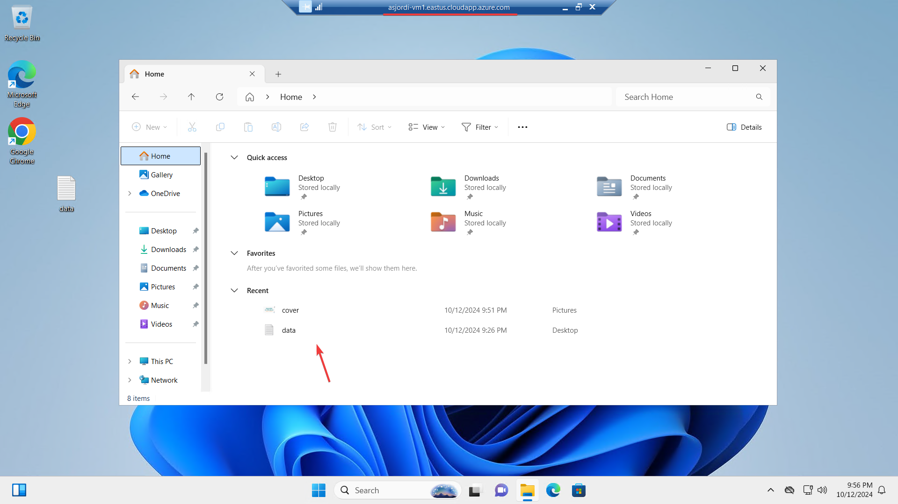
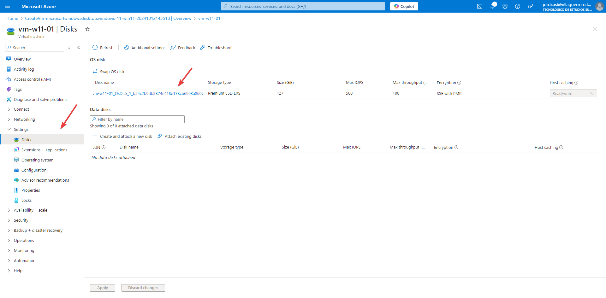
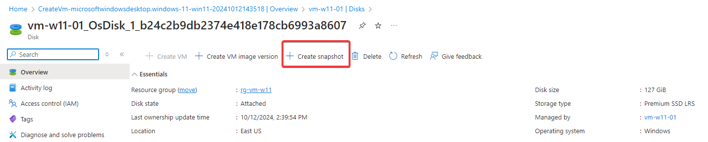
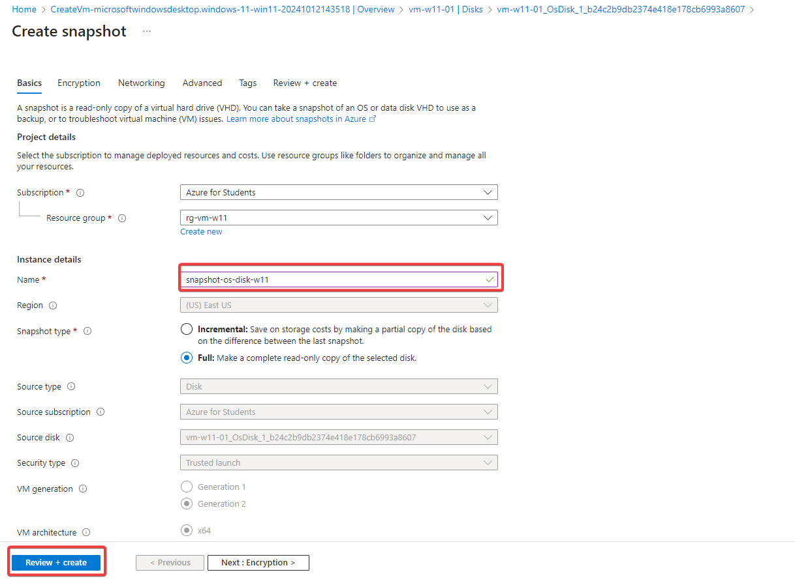
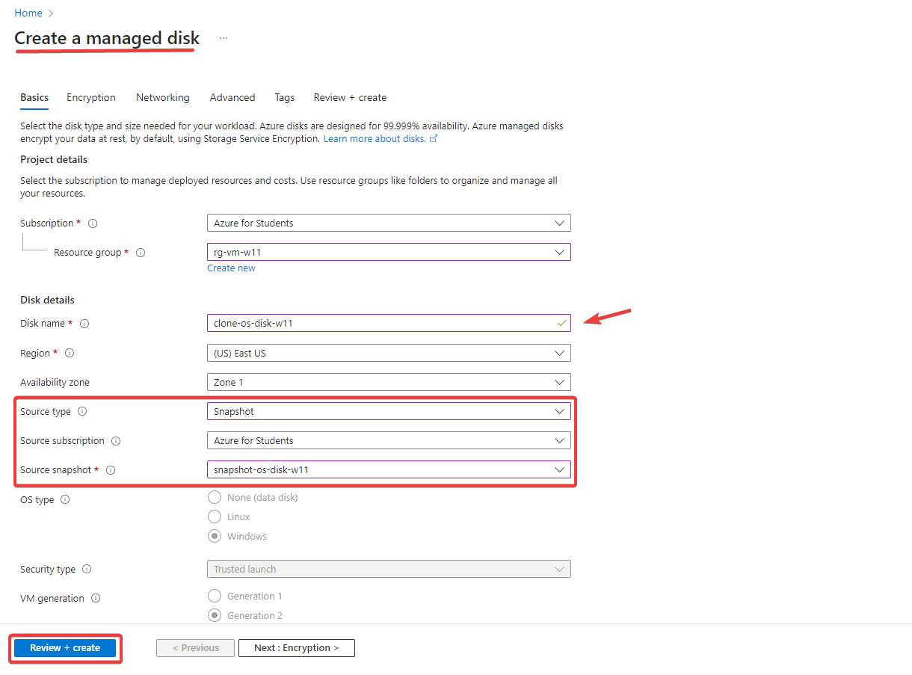
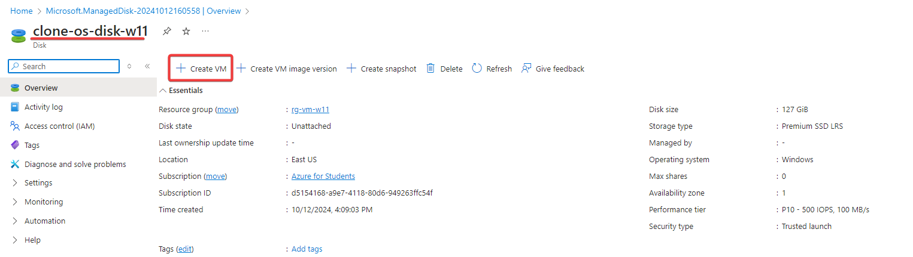
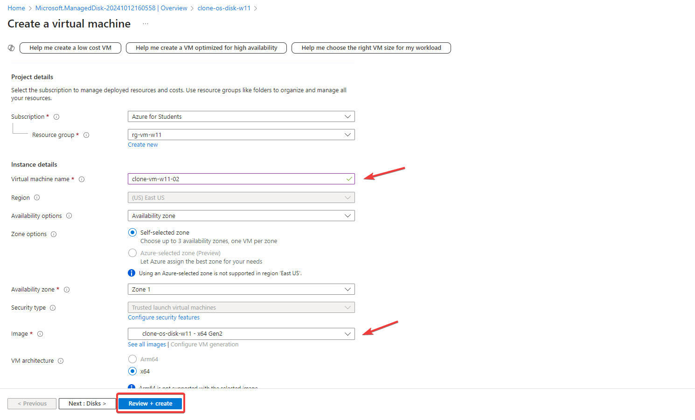
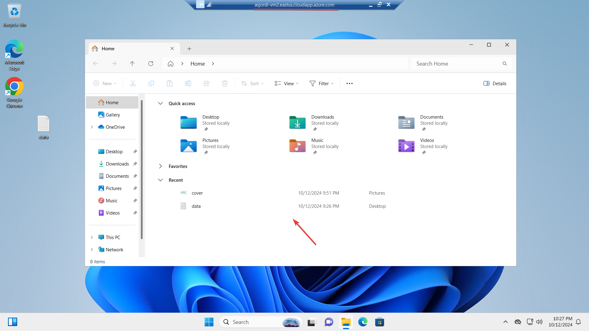
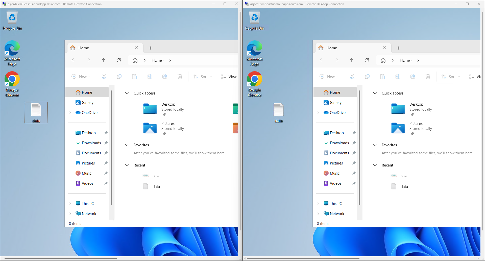

Clonar una máquina virtual en Azure no es una tarea complicada, aunque sería más fácil si hubiera una opción directa dentro del portal o algún comando, de igual manera son solo algunos pasos a seguir y en unos minutos tendrás tu máquina virtual clonada. En este caso tengo una máquina virtual con Windows 11 y quiero clonarla para tener una copia de seguridad o para realizar pruebas.

1. Dentro del recurso de la máquina virtual ir a Settings > Disks y seleccionar el disco que se quiere clonar.

2. Ahora, seleccionar la opción de **Create snapshot** (instantánea).

3. En la ventana de **Create snapshot** completar los campos requeridos, como suscripción, grupo de recursos, nombre del snapshot, tipo de snapshot (puede ser _incremental_ o _full_), etc. y dar clic en **Review + Create**. Si no se produce ningún error, el snapshot se generará en unos minutos.

(En caso de que la máquina virtual tenga más de un disco, se debe repetir el proceso anterior para cada uno de ellos).

4. Ahora es necesario crear un nuevo recurso del tipo **Managed Disk** (disco administrado). Completar los campos requeridos considerando lo siguiente:
   1. En el apartado **Source type** seleccionar **Snapshot**.
   2. Seleccionar la suscripción donde se creó el snapshot.
   3. Seleccionar el **snapshot** creado anteriormente.
   4. Dar clic en **Review + Create**.

(Repetir el paso anterior si se tienen más discos).

5. Acceder al recurso creado y dar clic en **Create VM**.

6. Completar los campos requeridos para la creación de la máquina virtual (en el apartado **Image** se puede observar que la máquina virtual se crea a partir del disco administrado creado anteriormente), en la sección **Disks** se pueden añadir los discos de datos administrados adicionales. Dar clic en **Review + Create**.

Finalmente, si no se produce ningún error, la máquina virtual se creará en unos minutos. Acceder al recurso y en caso de que se encuentre detenida iniciarla y acceder a ella.

Este es todo el proceso que se debe llevar a cabo para clonar una máquina virtual desde el portal de Azure y obtener una copia exacta de la máquina virtual original.

