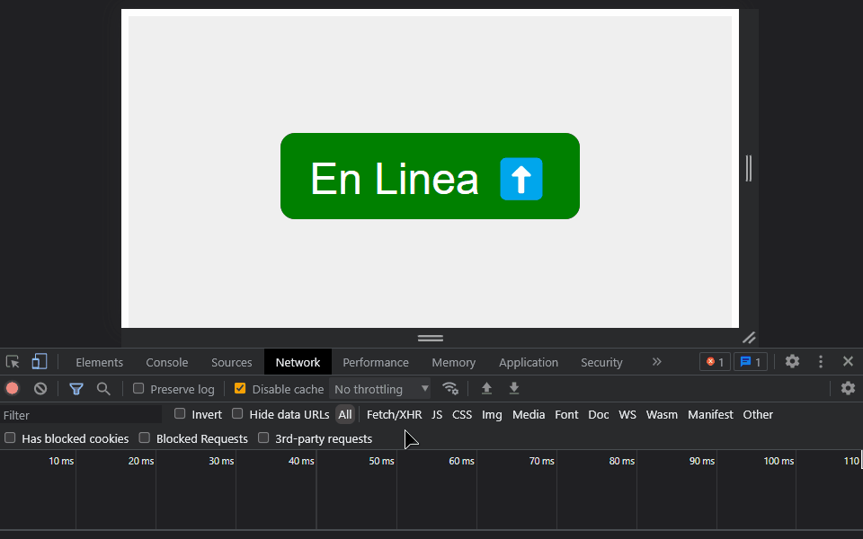

En ocasiones, es posible que se desee comprobar si el usuario está en línea o ha perdido la conexión a internet mientras navega por un sitio web. Por ejemplo, si el usuario está en línea, se puede mostrar un mensaje de bienvenida, pero si no está en línea, se puede mostrar un mensaje de error.

Es posible que los usuarios al ingresar al sitio web obtengan una versión en caché, por lo que podría dar la impresión de que el usuario está en línea, pero en realidad no lo está. Por lo tanto, es importante comprobar estos casos.

## Obtener el estado de la conexión

Para comprobar si el usuario está en línea o no, podemos usar la propiedad `navigator.onLine`. Esta devuelve un valor booleano que indica si el usuario está en línea o no, siendo `true` si está en línea y `false` si no lo está.

> Nota: Algunos navegadores pueden implementar de una manera diferente la propiedad `navigator.onLine`, por lo que es necesario revisar la [documentación](https://developer.mozilla.org/en-US/docs/Web/API/Navigator/onLine#Example) de cada navegador.

De esta manera podemos utilizarlo durante la carga inicial de la siguiente manera:

```js
window.addEventListener("load", () => {
  const status = navigator.onLine;
});
```

En este punto no sabemos si el estado de la red ha cambiado desde que se cargó el sitio web por primera vez, por lo que no es una opción ideal.

Podemos usar el evento `online` y `offline` para detectar cuando el estado de la red cambia. Estos eventos se disparan cuando el usuario se conecta o desconecta de la red.

```js
window.addEventListener("online", (e) => {
  console.log("En línea");
});

window.addEventListener("offline", (e) => {
  console.log("Sin conexión");
});
```

## Ejemplo

El siguiente ejemplo muestra la implementación de lo descrito anteriormente. Se utiliza un elemento de texto en el centro de la pantalla que muestra el estado de la conexión del usuario. Considerando que el valor predeterminado es donde el usuario tiene conexión a internet.

```html
<!DOCTYPE html>
<html lang="en">
  <head>
    <meta charset="UTF-8" />
    <meta name="viewport" content="width=device-width, initial-scale=1.0" />
    <meta name="description" content="" />
    <link rel="stylesheet" type="text/css" href="style.css" />
    <title>Estado de Conexión</title>
  </head>
  <body>
    <div class="status">
      <div class="offline-msg">Sin Conexión ⬇️</div>
      <div class="online-msg">En Linea ⬆️</div>
    </div>
    <script src="main.js"></script>
  </body>
</html>
```

Se agregan estilos básicos utilizando CSS.

```css
.status {
  background: #efefef;
  display: flex;
  justify-content: center;
  align-items: center;
  min-height: 100vh;
}

.status div {
  padding: 1rem 2rem;
  font-size: 3rem;
  border-radius: 1rem;
  color: white;
  font-family: Roboto, "Helvetica Neue", Arial, sans-serif;
}

.status .online-msg {
  background: green;
  display: block;
}

.status .offline-msg {
  background: red;
  display: none;
}
```

Como se mencionó anteriormente, de manera predeterminada se muestra el mensaje de que el usuario está en línea.

Para lo cual se debe agregar una condición para verificar si el elemento con la clase `status` tiene la clase `offline`.

```css
.status.offline .online-msg {
  display: none;
}

.status.offline .offline-msg {
  display: block;
}
```

Si ahora se agrega la clase `offline` al elemento con la clase `status`, se mostrará el mensaje de que el usuario no está en línea.

En este punto es necesario poder agregar y eliminar la clase `offline` al elemento con la clase `status` cuando el usuario se conecta o desconecta de la red. Para lo cual se debe agregar el siguiente código en el archivo `main.js`.

```js
const status = document.querySelector(".status");
window.addEventListener("load", () => {
  const handleNetworkChange = () => {
    if (navigator.onLine) {
      status.classList.remove("offline");
    } else {
      status.classList.add("offline");
    }
  };

  window.addEventListener("online", handleNetworkChange);
  window.addEventListener("offline", handleNetworkChange);
});
```

Utilizando el código anterior, se inicializa el estado de la conexión del usuario al cargar el sitio web. Después, se agregan los eventos `online` y `offline` para detectar cualquier cambio en el estado de la conexión del usuario. Si el usuario se conecta a la red, se elimina la clase `offline` del elemento con la clase `status`, de lo contrario, se agrega la clase `offline`.

## Demo


