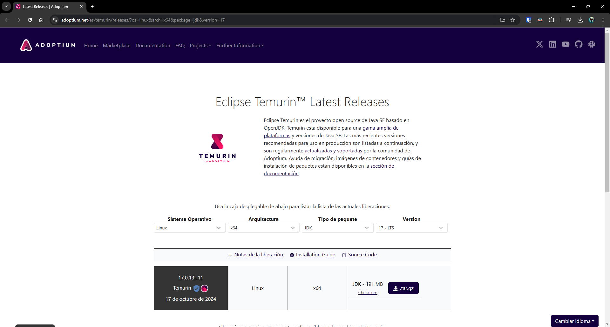
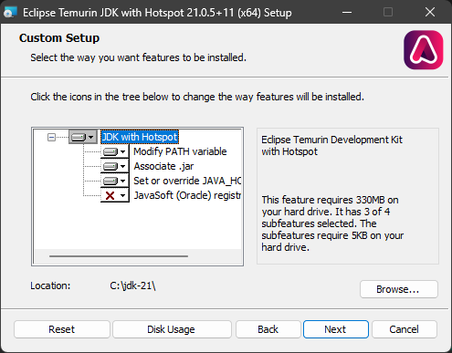
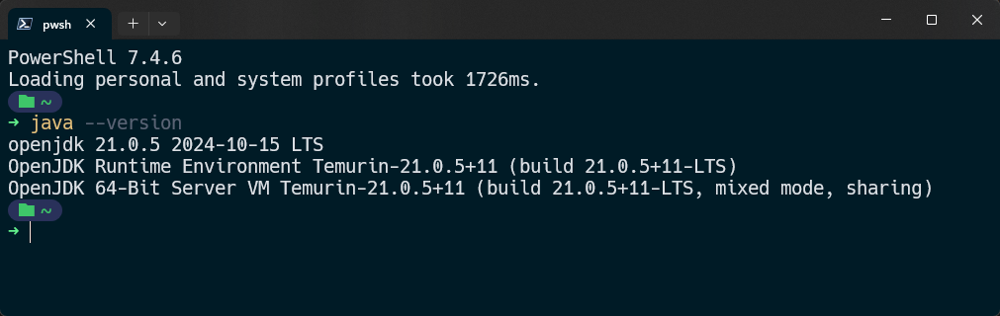

Existen muchas maneras de instalar el JDK de Java en Windows, anteriormente se usaba el JDK de Oracle, pero ahora dado que Oracle ha realizado cambios en la licencia de uso, se recomienda utilizar ya sea el OpenJDK o alguna de las tantas distribuciones que existen, las cuales toman como base el OpenJDK y agregan mejoras y optimizaciones. Una de las más populares es la distribución de **Adoptium**, anteriormente conocida como AdoptOpenJDK, la cual ofrece builds del OpenJDK para diferentes sistemas operativos y arquitecturas. **Eclipse Temurin** es el nombre de la distribución OpenJDK de Adoptium. Una de las ventajas respecto al OpenJDK es que Temurin ofrece soporte a largo plazo, lo que significa que se recibirán actualizaciones de seguridad y correcciones de errores durante un tiempo prolongado.

En este artículo veremos cómo instalar el JDK de Java usando Temurin en Windows y las consideraciones que debemos tener en cuenta para que todo funcione correctamente.

## Descargar Temurin

Para instalar Temurin en Windows, lo primero que debemos hacer es descargar el instalador desde la página oficial de Adoptium. Para ello, accedemos a [https://adoptium.net/es/](https://adoptium.net). Una vez en la página, la manera más directa es hacer clic en el botón **Última versión de LTS**, esto descargará automáticamente el instalador de la versión LTS más reciente de Temurin, en este caso la versión 21 (aproximadamente cada 3 años se lanza una nueva versión LTS).


En caso de que queramos descargar una versión específica podemos hacer clic en el botón **Otras plataformas y versiones** y comenzar a filtrar por sistema operativo, arquitectura, tipo de paquete y versión de Java.



## Instalar Temurin

Una vez descargado el instalador, hacemos doble clic sobre él para ejecutarlo. A continuación, se abrirá una ventana de instalación en la que debemos hacer clic en el botón **Next** para comenzar con el proceso de instalación. En la siguiente ventana, aceptamos los términos de la licencia y hacemos clic en **Next**. Seleccionamos si queremos que se instale solo para el usuario actual o para todos los usuarios y hacemos clic en **Next**.

En la última ventana de _instalación personalizada_ es importante tener en consideración las siguientes opciones:

- Agregar el directorio de instalación al PATH del sistema.
- Asociar archivos .jar con Adoptium (permite ejecutar archivos .jar haciendo doble clic sobre ellos).
- Crear o sobrescribir la variable de entorno JAVA_HOME con la ruta de instalación de Adoptium.

En caso de que esta sea la única versión de Java que vamos a tener instalada en el sistema, podemos dejar seleccionadas estas opciones, pero si tenemos varias versiones de Java instaladas, es recomendable desmarcar estas opciones, ya que podríamos tener algunos inconvenientes al ejecutar algunas aplicaciones o trabajar con IDEs como Eclipse o IntelliJ IDEA, ya que estos utilizan la variable de entorno JAVA_HOME para saber qué versión de Java utilizar.

> **Nota:** Siempre podemos configurar manualmente estas variables de entorno en caso de que no las hayamos configurado durante la instalación, podemos tomar como referencia el siguiente post [https://asjordi.dev/blog/como-instalar-el-openjdk-de-java-en-windows](https://asjordi.dev/blog/como-instalar-el-openjdk-de-java-en-windows) donde se explica cómo configurar las variables de entorno en Windows.

Por último, podemos cambiar la ruta de instalación, en lo personal prefiero instalarlo en la carpeta **C:\jdk-version**, donde **version** es la versión de Java que estamos instalando, por ejemplo **C:\jdk-21**. Una vez configuradas las opciones, hacemos clic en **Next** y después en **Install** para comenzar con la instalación. Al finalizar, hacemos clic en **Finish** para cerrar el instalador.



## Verificar la instalación

Para verificar que la instalación se realizó correctamente, abrimos una terminal de Windows y ejecutamos el siguiente comando:

```bash
java -version
```

Si todo está correcto, deberíamos ver un mensaje similar al siguiente.



En caso de que muestre un mensaje de error, es posible que no se haya configurado correctamente la variable de entorno JAVA_HOME o que no se haya agregado la ruta de instalación al PATH del sistema. Para ello puedes revisar el post mencionado anteriormente donde se explica cómo configurar las variables de entorno en Windows.

Estos son todos los pasos necesarios para instalar Temurin en Windows, solo es cuestión de seguir el asistente de instalación y tener las consideraciones necesarios respecto a las variables de entorno para que todo funcione correctamente.