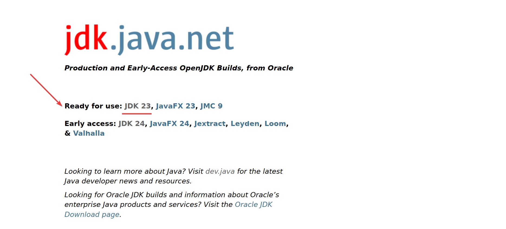

## Introducción

El JDK (Java Development Kit) es un conjunto de herramientas que permiten desarrollar aplicaciones usando el lenguaje de programación Java, este ya incluye el JRE (Java Runtime Environment) que es necesario para ejecutar los programas. Como sabemos Java pertenece a Oracle, y esta empresa distribuye dos versiones de Java, la versión de Oracle y la versión de OpenJDK, siendo el OpenJDK la versión de código abierto y la implementación de referencia del lenguaje de programación Java, por su parte el Oracle JDK es la misma implementación del OpenJDK, pero con algunas modificaciones y mejoras propias de Oracle, además de que posee una licencia comercial.

El OpenJDK es una excelente opción para desarrollar aplicaciones Java, ya que es de código abierto y es compatible con la mayoría de las aplicaciones Java, además de que es gratuito y no tiene restricciones de uso, solo es necesario considerar que cada versión del OpenJDK tiene un soporte limitado, por lo que es recomendable siempre utilizar la última versión disponible, incluso aunque sea una versión de soporte a largo plazo (LTS).

## Descargar el OpenJDK

Para descargar el OpenJDK debemos dirigirnos a su página oficial [https://jdk.java.net](https://jdk.java.net), una vez en la página debemos seleccionar la versión más reciente que se indica en el apartado **Ready for use**, en este caso la versión 23. El apartado **Early access** hace referencia a versiones que se encuentran actualmente en desarrollo, por lo que no son tan recomendadas para trabajar, a menos que se quiera probar las nuevas características que se están desarrollando.

A continuación en la sección **Builds** seleccionamos el sistema operativo de nuestra computadora, en este caso seleccionamos la versión para Windows x64, solo debemos hacer clic en el enlace llamado **zip** y comenzará la descarga del archivo comprimido.

Una vez que se haya descargado el archivo, lo descomprimimos, entramos a la carpeta y veremos que contiene una carpeta llamada **jdk-23**, esta carpeta contiene el OpenJDK, por lo que la movemos a una ubicación de nuestra preferencia, en lo personal la coloco en la raíz de la unidad C. Una vez completado este paso, podemos ingresar a la carpeta y veremos que contiene una carpeta llamada **bin**, la cual contiene los ejecutables de Java, por ejemplo, `javac.exe` que es el compilador de Java.

## Configurar las variables de entorno

Para poder utilizar el OpenJDK correctamente es necesario configurar las variables de entorno, para ello podemos presionar la tecla de Windows y escribir **variables de entorno**, seleccionamos la opción **Editar las variables de entorno del sistema**. Dentro de esta ventana seleccionamos el botón **Variables de entorno**.

En la nueva ventana dentro de **Variables del Sistema** seleccionamos el botón **Nuevo**, en **Nombre de la variable** escribimos `JAVA_HOME` y en **Valor de la variable** escribimos la ruta donde se encuentra el OpenJDK, en mi caso `C:\jdk-23` y damos clic en **Aceptar**.

En la misma sección de **Variables del Sistema** seleccionamos la variable **Path** y damos clic en **Editar**, en la nueva ventana seleccionamos **Nuevo** y escribimos `%JAVA_HOME%\bin` y damos clic en **Ok**. Definir de esta manera la variable `%JAVA_HOME%\bin` nos da la ventaja de que sí en algún momento actualizamos el OpenJDK o movemos la carpeta a otra ubicación, solo será necesario cambiar la variable `JAVA_HOME` y no la variable `Path`.

Hacemos clic en **Aceptar** en todas las ventanas abiertas para guardar los cambios realizados.

## Verificar la instalación

Para verificar que la instalación se realizó correctamente, abrimos una terminal de Windows y escribimos `java --version`, si todo está correcto se mostrará la versión del OpenJDK instalada.

Con estos pasos hemos instalado el OpenJDK en Windows y configurado las variables de entorno para poder utilizarlo correctamente y comenzar a desarrollar aplicaciones Java.

## Conclusión

El OpenJDK solo es una distribución más del JDK de Java, existen muchas otras distribuciones por parte de diferentes empresas, pero el OpenJDK es una excelente opción para desarrollar aplicaciones Java, solo hay que considerar que cada versión tiene un soporte limitado, por lo que es recomendable siempre utilizar la última versión disponible, incluso aunque sea una versión de soporte a largo plazo (LTS). En caso de que necesites instalar una versión previa y que no se muestre en la página principal se puede ingresar a la sección de [Archived](https://jdk.java.net/archive/) y buscar la versión deseada, el proceso de instalación es el mismo.