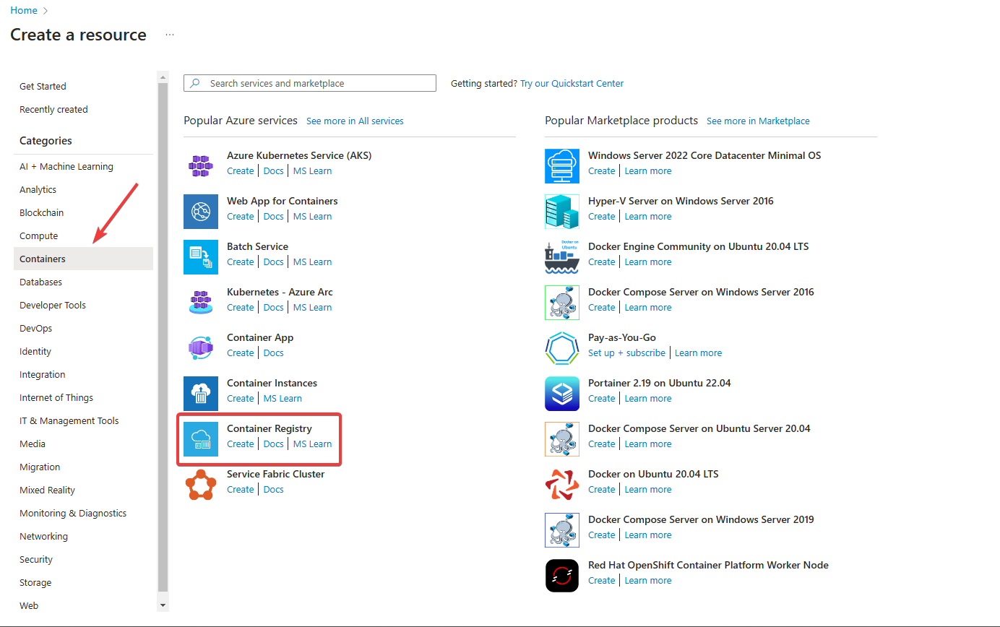
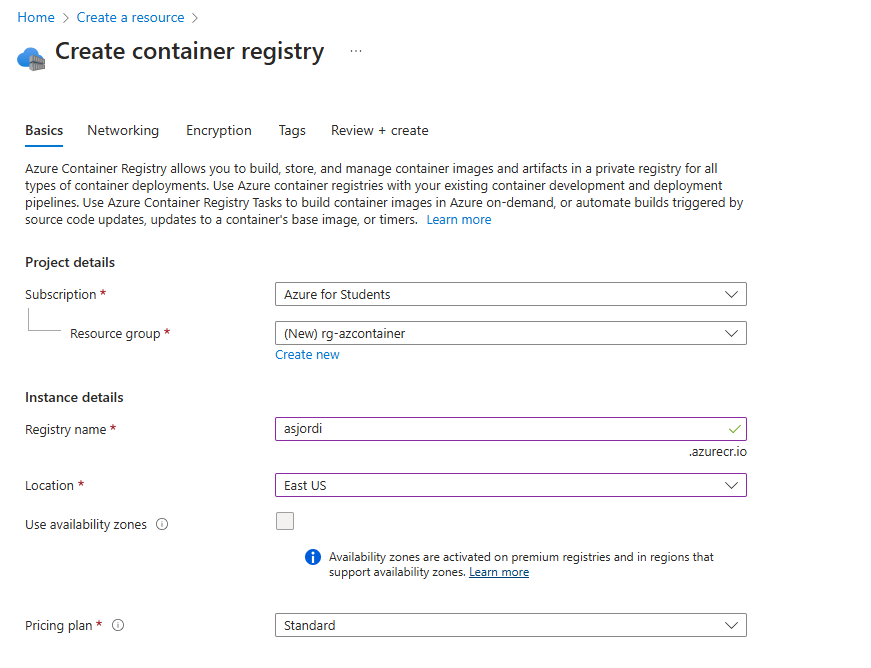
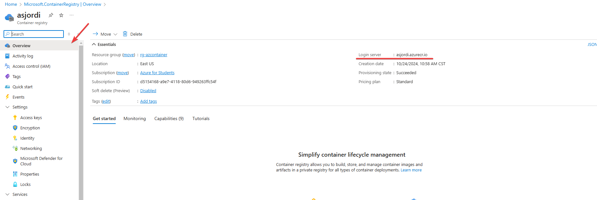
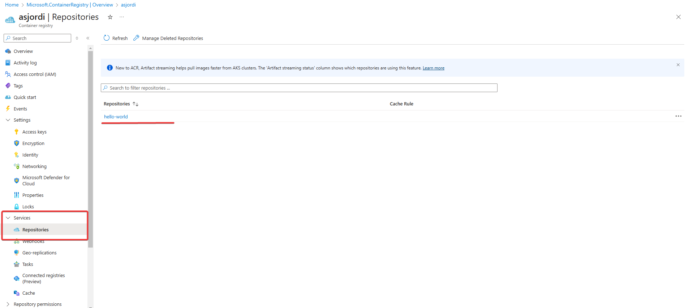
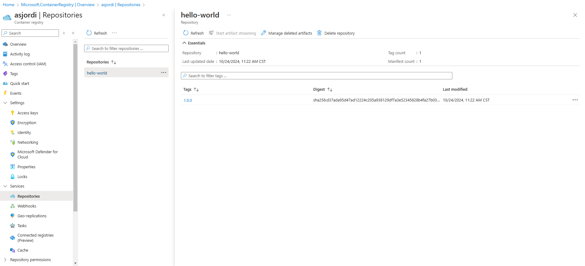
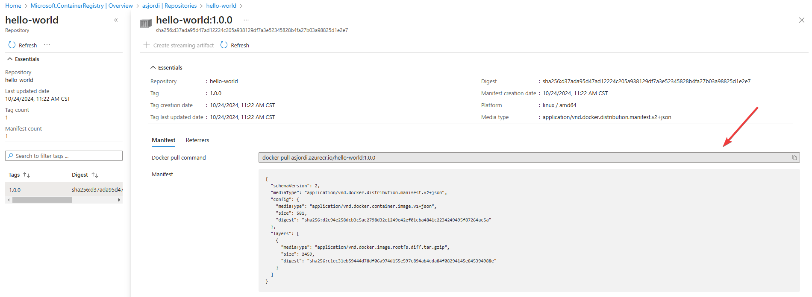

En el mundo del desarrollo, los contenedores se han convertido en una herramienta fundamental para empacar y distribuir aplicaciones, por lo que tener un registro de contenedores es esencial para almacenar y administrar imágenes de Docker, aunque en algunos casos, puede que con solo subir tu imagen a Docker Hub sea suficiente, en otros casos, al tratarse de imágenes privadas, es necesario contar con un registro privado, como Azure Container Registry.

Un registro de contenedores es como un repositorio o biblioteca especializada que permite almacenar y distribuir imágenes de contenedores, teniendo como componentes principales los siguientes elementos:

- Almacenamiento: Guardar imágenes y sus diferentes versiones (tags).
- API: Permite subir y descargar imágenes.
- Control de acceso: Gestiona quién puede acceder a las imágenes.

Es similar a un repositorio de código como GitHub, pero en lugar de almacenar código fuente, almacena imágenes de contenedores. Existen varios servicios de registro de contenedores, como Docker Hub, Google Container Registry, Amazon Elastic Container Registry y Azure Container Registry.

## Azure Container Registry

Azure Container Registry es un servicio de registro privado para compilar, almacenar y proporcionar imágenes de contenedores. Puedes usar Azure Container Registry para almacenar imágenes de Docker de forma segura y distribuirlas a los equipos de desarrollo, los sistemas de CI/CD y los entornos de producción. 

Durante este tutorial, veremos cómo crear una instancia de Azure Container Registry desde el portal de Azure y cómo subir una imagen de Docker.

## Prerrequisitos

Es necesario tener instalado lo siguiente:
- [CLI de Azure](https://learn.microsoft.com/es-es/cli/azure/install-azure-cli)
- [Docker](https://docs.docker.com/get-started/get-docker/)

Una vez instalados se pueden ejecutar los siguientes comandos para verificar que todo esté correctamente instalado:

```bash
az --version
docker --version
```

## Crear un Azure Container Registry

La creación de la instancia de Azure Container Registry se puede realizar desde el portal de Azure o mediante la CLI de Azure. En este caso, lo haremos desde el [Azure Portal](https://portal.azure.com/) para lo cual se debe iniciar sesión.

Seleccionar **Crear un recurso > Contenedores > Registro de contenedores**.



En la pestaña **Aspectos básicos** llenar los siguientes campos:

- Seleccionar o crear un grupo de recursos.
- Escribir un nombre único para el registro, considerar que este nombre se usará para acceder al registro.
- Seleccionar la ubicación del registro.
- Seleccionar la SKU, en este caso, se seleccionará **Standard**.

Mantener los valores predeterminados para los demás apartados y seleccionar **Revisar y crear**. Para este caso se crea un registro básico, en el apartado de **SKU** se puede seleccionar **Premium** para obtener características adicionales, como la conexión mediante un punto de conexión privado.



Una vez que se haya creado el registro, seleccionar **Ir al recurso**.



En este punto, es necesario copiar el **nombre del registro** (aparece en la parte superior izquierda) y el nombre del **servidor de inicio de sesión** (termina en _azurecr.io_), ya que se necesitarán en los siguientes pasos.

## Iniciar sesión en el registro localmente

En este punto es necesario que ya se haya iniciado sesión en Azure desde la CLI de Azure, si no es así, se puede hacer con el siguiente comando:

```bash
az login
```

Para iniciar sesión en el registro de contenedores, se debe ejecutar el siguiente comando:

```bash
az acr login --name <nombre_registro>
```

Donde `<nombre_registro>` es el nombre del registro que se copió en el paso anterior. Por ejemplo:

```bash
az acr login --name asjordi
```

Si todo está correcto, se mostrará el mensaje **Login Succeeded**.

## Subir una imagen de Docker

En este paso utilizaremos como ejemplo la imagen [hello-world](https://hub.docker.com/_/hello-world) de Docker Hub, pero se puede utilizar cualquier imagen.

Para poder subir una imagen al registro de contenedores, esta se debe etiquetar con el nombre completo del servidor de inicio de sesión del registro (copiado en el paso anterior) que tiene el formato `<nombre_registro>.azurecr.io`, por ejemplo `asjordi.azurecr.io`. El comando para etiquetar la imagen es el siguiente:

```bash
docker tag <nombre_imagen> <nombre_registro>.azurecr.io/<nombre_imagen>:tag
```

Usando nuestra imagen de ejemplo:

```bash
docker tag hello-world asjordi.azurecr.io/hello-world:1.0.0
```

Si ejecutamos `docker image ls` podríamos ver la imagen etiquetada con el nombre `asjordi.azurecr.io/hello-world:1.0.0` (o el nombre que hayamos elegido).

Finalmente, para subir la imagen al registro de contenedores se usa el comando `docker push` seguido del nombre de la imagen etiquetada anteriormente:

```bash
docker push asjordi.azurecr.io/hello-world:1.0.0
```

Este paso puede tardar unos minutos, dependiendo del tamaño de la imagen y la velocidad de la conexión a Internet.

## Listar imágenes en el registro

Para mostrar las imágenes en el registro desde el Portal de Azure, dirigirse al panel lateral izquierdo y seleccionar **Servicios > Repositorios** y se mostrarán las imágenes que se han subido.



Al seleccionar la imagen se pueden ver los detalles, como las etiquetas y la fecha de la última actualización.



## Descargar una imagen del registro

Para descargar una imagen del registro de contenedores, se debe ejecutar el comando `docker pull` seguido del nombre de la imagen:

```bash
docker pull asjordi.azurecr.io/hello-world:1.0.0
```

También podemos obtener esta información si hacemos clic sobre la imagen y el tag específico en el portal de Azure.



## Conclusiones

Esta es la manera en que podemos crear un registro de contenedores privados usando Azure Container Registry y subir una imagen de Docker desde nuestra máquina local. Desde este punto podemos integrar el registro de contenedores con otros servicios de Azure, por ejemplo, si nuestra imagen almacena una aplicación web, podemos desplegarla en Azure App Service. No olvides eliminar el grupo de recursos o los recursos que ya no necesites para evitar cargos adicionales, en este caso Azure Container Registry.