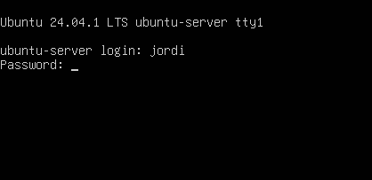
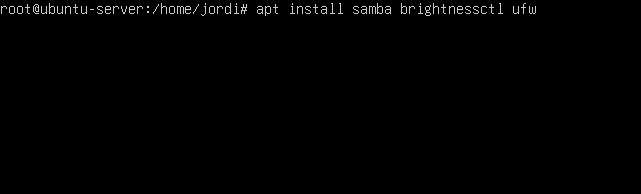
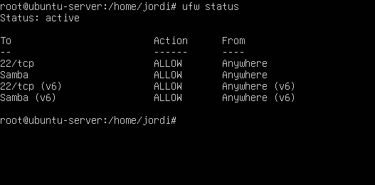
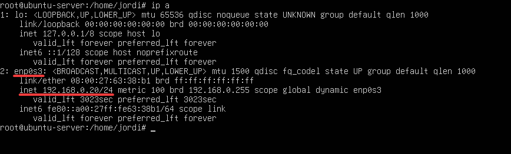
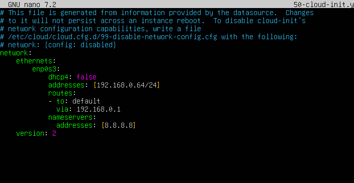
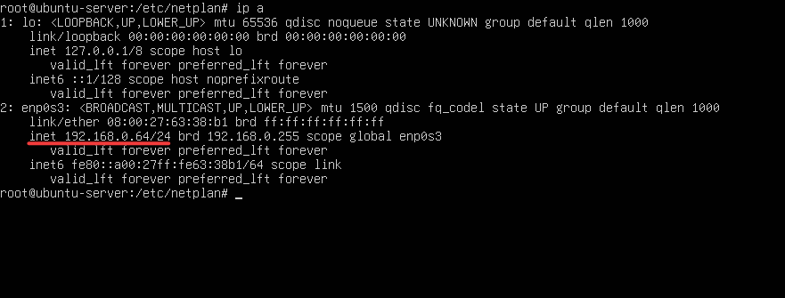
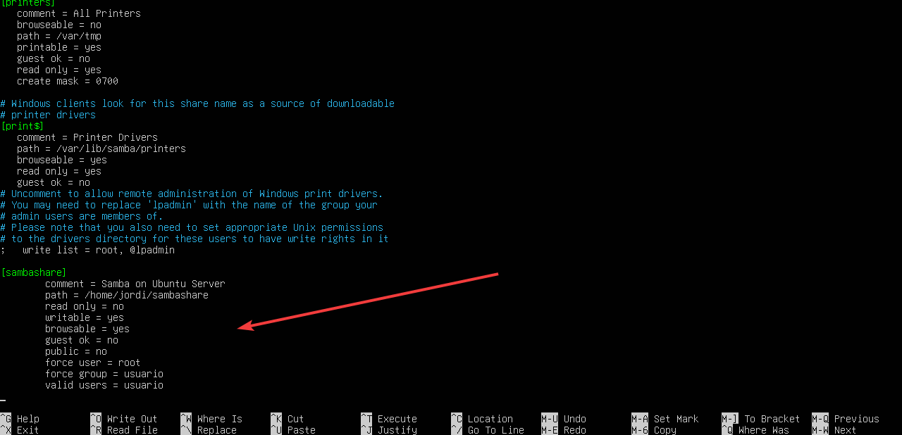
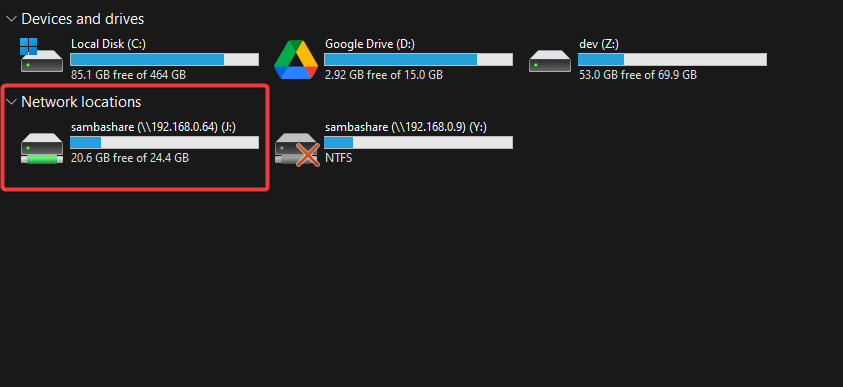
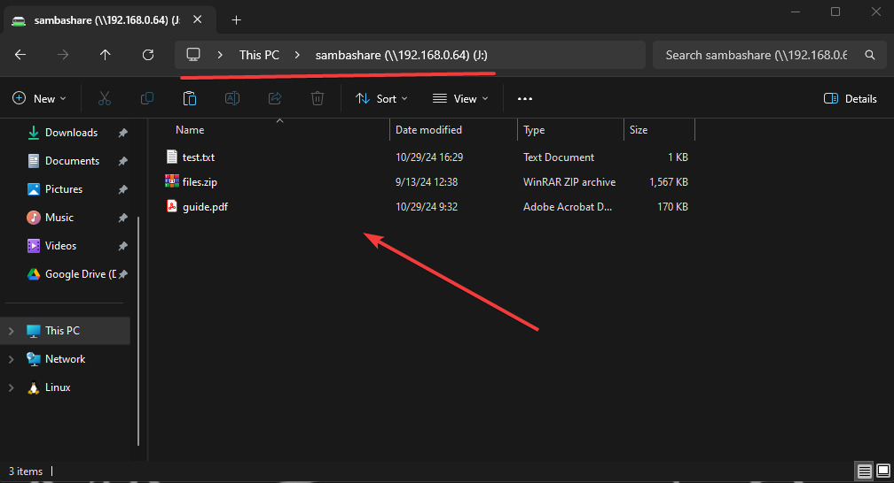

Cuando queremos compartir archivos dentro de una red local puede que el crear una carpeta compartida en un sistema operativo no sea suficiente, ya sea por el espacio de almacenamiento disponible, la incompatibilidad en los protocolos de comunicación, la disponibilidad del equipo, entre otras razones, por lo cual el crear un servidor de archivos dedicado puede ser una solución viable si contamos con un equipo que no utilizamos y queremos aprovecharlo para este fin. 

Un servidor de archivos es un sistema que proporciona acceso a archivos y carpetas a través de una red utilizando protocolos de comunicación como SMB, NFS, FTP, entre otros. Por su parte, un NAS es un dispositivo (o servidor) dedicado a almacenar y compartir datos en una red, permitiendo que otros dispositivos en la misma red accedan a los archivos. Ambas son soluciones similares, pero la diferencia radica en que un NAS es un dispositivo dedicado para este fin, mientras que un servidor de archivos puede ser un equipo que utilizamos para otros fines y que también compartimos archivos.

En este tutorial vamos a configurar un servidor de archivos local utilizando Ubuntu Server y Samba, lo cual nos permitirá tener compatibilidad entre sistemas operativos Windows y Linux, además de que podremos acceder a los archivos desde cualquier dispositivo en la red local, ya sea una computadora, un teléfono, una tablet, entre otros.

## Requisitos

- Un equipo de cómputo.
- Ubuntu Server instalado o la imagen ISO para instalarlo.
- Conexión a internet, preferentemente por cable.

## Instalar Ubuntu Server

Para instalar Ubuntu Server puedes seguir la siguiente guía oficial: [Instalación de Ubuntu Server](https://ubuntu.com/tutorials/install-ubuntu-server), solo hay que tener en cuanta los siguientes puntos:

- Configurar correctamente el usuario y contraseña de administrador.
- Utilizar todo el disco para la instalación, no tiene mucho sentido crear particiones si el equipo solo se utilizará para compartir archivos.
- Se puede configurar la encriptación del disco, considerar que esto puede afectar el rendimiento del servidor.
- Configurar la dirección IP estática para el servidor, esto es opcional, ya que más adelante lo haremos.
- Durante la instalación, asegúrate de seleccionar la opción de instalar el servidor SSH, ya que lo utilizaremos para conectarnos al servidor de archivos.

## Instalar paquetes necesarios

Una vez que hacemos login en el servidor, procedemos a instalar los paquetes necesarios para configurar el servidor de archivos. Para ello, ejecutamos los siguientes comandos:



```bash
sudo apt update
sudo apt upgrade
sudo apt install samba brightnessctl ufw
```

- `samba`: Es el paquete que nos permitirá compartir archivos en la red local.
- `brightnessctl`: Es un paquete que nos permitirá controlar el brillo de la pantalla.
- `ufw`: Es un firewall que nos permitirá configurar reglas de seguridad en el servidor.



## Configurar el firewall

Debemos configurar el firewall para permitir el tráfico de red en el servidor mediante `SSH` y `Samba`. Para ello, ejecutamos el siguiente comando:

```bash
sudo ufw allow ssh
sudo ufw allow samba
```

Activamos el firewall con el siguiente comando:

```bash
sudo ufw enable
```

Podemos comprobar que el firewall está activo con el siguiente comando:

```bash
sudo ufw status
```



## Configurar IP estática

En caso de que no hayamos configurado la dirección IP estática durante la instalación de Ubuntu Server, podemos seguir los siguientes pasos, de lo contrario, podemos omitir esta sección. Para verificar la interfaz de red y dirección IP actual, ejecutamos el siguiente comando:

```bash
ip a
```

También podemos utilizar el comando `ifconfig` (en caso de que no esté instalado, podemos instalarlo con `sudo apt install net-tools`), con ambos comandos podemos identificar la interfaz de red, en mi caso es `enp0s3`, y la dirección IP actual, en mi caso es `192.168.0.20`.



Para comenzar hacemos login como superusuario:

```bash
sudo su
```

Abrimos el archivo `/etc/netplan/50-cloud-init.yaml` con nano para editarlo (puede que el nombre sea diferente, pero el archivo debe estar en la misma ruta):

```bash
nano /etc/netplan/50-cloud-init.yaml
```

Agregamos la siguiente configuración al archivo, debemos cambiar los valores para la interfaz de red, dirección IP y máscara de subred, puerta de enlace y servidores DNS según nuestra red:

```yaml
network:
    ethernets:
        enp0s3:
            dhcp4: false
            addresses: [192.168.0.64/24]
            routes:
            - to: default
              via: 192.168.0.1
            nameservers:
              addresses: [8.8.8.8]
    version: 2
```



A continuación se muestra una descripción de los campos:

- `network`: Es el elemento raíz del fichero de configuración y significa el inicio de la configuración de red.
- `ethernets`: Esta sección especifica el inicio de la configuración de las interfaces ethernet.
- `enp0s3`: Identifica la interfaz Ethernet específica que se está configurando (puede variar dependiendo del sistema).
- `dhcp4`: Indica si la interfaz obtiene una dirección IP automáticamente de un servidor DHCP, en este caso se establece en `false` para configurar una dirección IP estática.
- `addresses`: Aquí se especifica la dirección IP estática y la máscara de subred, en este caso `192.168.0.64/24`.
- `routes`: Esta sección define rutas estáticas donde: `default` especifica una ruta por defecto a través de la puerta de enlace, 192.168.0.1, con via: 192.168.0.1.
- `nameservers`: Esta clave especifica los servidores DNS que utilizará el sistema.

Una vez configurado, presionar `Ctrl + O` seguido de `Enter` para guardar los cambios y `Ctrl + X` para salir. Ejecutamos el siguiente comando para aplicar los cambios:

```bash
netplan apply
```

Nuevamente, podemos ejecutar el comando `ip a` para verificar que la dirección IP estática se ha configurado correctamente.



## Crear usuario para Samba

Para compartir archivos en la red local, necesitamos crear un usuario en el servidor de archivos. Para ello, ejecutamos el siguiente comando:

```bash
sudo adduser usuario
```

En este caso `usuario` es el nombre del usuario que vamos a crear, podemos utilizar el nombre que queramos. A continuación, establecemos una contraseña para el usuario:

```bash
sudo smbpasswd -a usuario
```

## Crear directorio para compartir archivos

Creamos un directorio que nos servirá para almacenar los archivos que queremos compartir en la red local. En este caso se llamará `sambashare` y estará ubicado en `/home/jordi` (puedes cambiar la ubicación y el nombre del directorio según tus necesidades):

```bash
sudo mkdir /home/jordi/sambashare
```

Ahora debemos asignarle permisos sobre el directorio `sambashare` al usuario que hemos creado, cambiar `jordi` por el nombre de usuario que se creó al instalar Ubuntu Server, y `usuario` por el nombre del usuario que hemos generado anteriormente, al igual que la ruta del directorio:

```bash
sudo chown -R jordi:usuario /home/jordi/sambashare
```

## Configurar Samba

Para configurar Samba, debemos editar el archivo `/etc/samba/smb.conf`, para ello ejecutamos el siguiente comando:

```bash
sudo nano /etc/samba/smb.conf
```

Al final de este archivo agregamos la siguiente configuración:

```text
[sambashare]
    comment = Samba on Ubuntu Sever
    path = /home/jordi/sambashare
    read only = no
    writable = yes
    browsable = yes
    guest ok = no
    public = no
    force user = root
    force group = usuario
    valid users = usuario
```

- `sambashare`: Es el nombre de la carpeta compartida.
- `comment`: Es un comentario opcional.
- `path`: Es la ruta del directorio que queremos compartir.
- `read only`: Indica si el directorio es de solo lectura, en este caso se establece en `no`.
- `writable`: Indica si el directorio es de escritura, en este caso se establece en `yes`.
- `browsable`: Indica si el directorio es navegable, en este caso se establece en `yes`.
- `guest ok`: Indica si se permite el acceso de invitados, en este caso se establece en `no`.
- `public`: Indica si el directorio es público, en este caso se establece en `no`.
- `force user`: Fuerza que cualquier operación realizada en el recurso compartido sea tratada como si la ejecutara el usuario root, sin importar qué usuario autenticado esté usando el recurso.
- `force group`: Fuerza que cualquier archivo o directorio creado en el recurso compartido pertenezca al grupo usuario, sin importar el grupo del usuario autenticado.
- `valid users`: Especifica que solo el usuario puede acceder al recurso compartido. Esto permite restringir el acceso a usuarios específicos.



Presionamos `Ctrl + O` seguido de `Enter` para guardar los cambios y `Ctrl + X` para salir. Para verificar nuestra configuración ejecutamos el siguiente comando:

```bash
testparm
```

Si no hay errores, reiniciamos el servicio de Samba con el siguiente comando:

```bash
sudo systemctl restart smbd
```

Podemos verificar el estado del servicio con el siguiente comando:

```bash
sudo systemctl status smbd
```

## Acceder a la carpeta compartida desde Windows

Para acceder a la carpeta compartida desde Windows, abrimos `powershell` y ejecutamos el siguiente comando:

```bash
NET USE J: \\192.168.0.64\sambashare
```

Donde `J:` es la letra de la unidad que queremos asignar a la carpeta compartida y `192.168.0.64` la dirección IP del servidor de archivos. Nos pedirá el nombre de usuario y contraseña que hemos creado anteriormente, en este caso `usuario` y su contraseña. Si no ocurre ningún error, ya sea de autenticación o de conexión, nos mostrará un mensaje similar a `The command completed successfully.` y montará la carpeta compartida en la unidad `J:`.

Para verificar que la carpeta compartida se ha montado correctamente, podemos abrir el explorador de archivos y verificar que la unidad `J:` está disponible, realizar algunas pruebas de escritura y lectura, y comprobar que esos archivos se reflejan en nuestro servidor de archivos.





## Apagar pantalla del servidor

En caso de que el equipo sea una laptop podemos apagar remotamente la pantalla accediendo mediante `SSH` y con el paquete `brightnessctl`.

```bash
ssh usuario@ip

# Ejemplo
ssh jordi@192.168.0.64
```

Una vez dentro del servidor, ejecutamos el siguiente comando para apagar la pantalla:

```bash
brightnessctl s 0
```

Para encender la pantalla, ejecutamos el comando anterior con el valor `100`:

```bash
brightnessctl s 100
```

En caso de que sea un equipo de escritorio, basta con apagar el monitor manualmente, o también este proceso es válido, todo depende de nuestras necesidades.

## Conclusión

Estos son todos los pasos necesarios para configurar un servidor de archivos de manera local utilizando Ubuntu Server y Samba. Con esto, podemos compartir archivos en la red local de manera sencilla y segura, además de que podemos acceder a los archivos desde cualquier dispositivo en la red local. Aprovechando este equipo de cómputo podemos configurar otros servicios como un servidor de impresión, un servidor de correo, desplegar una página web, usar docker y exponer servicios, entre otros.