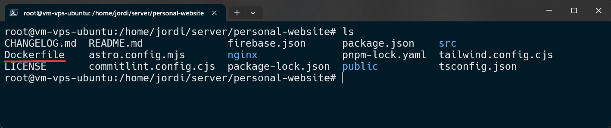
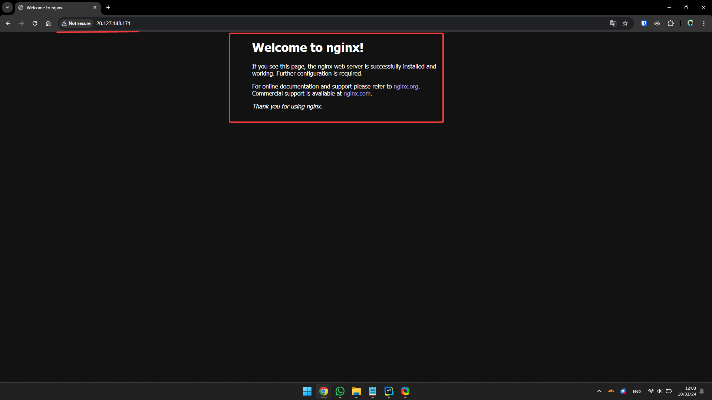
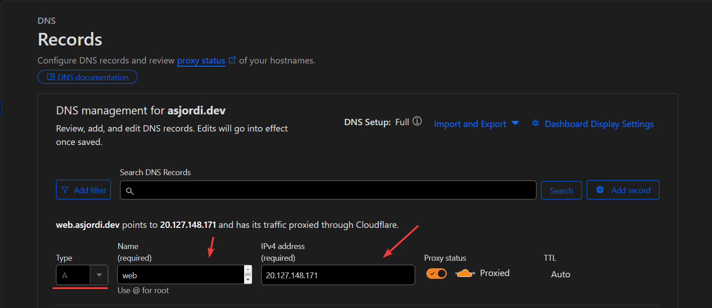
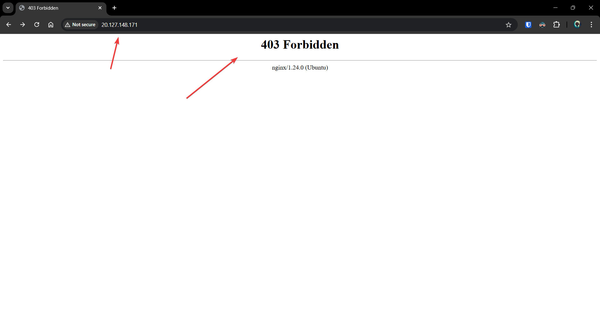
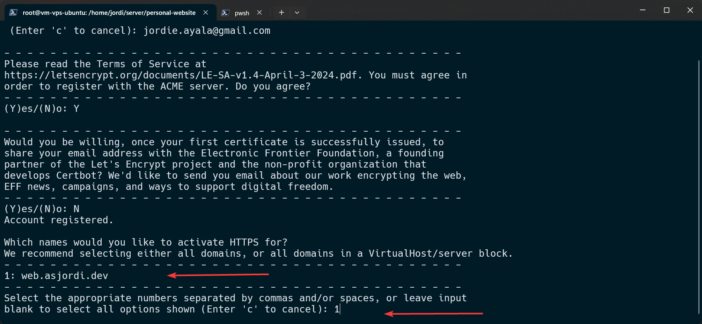
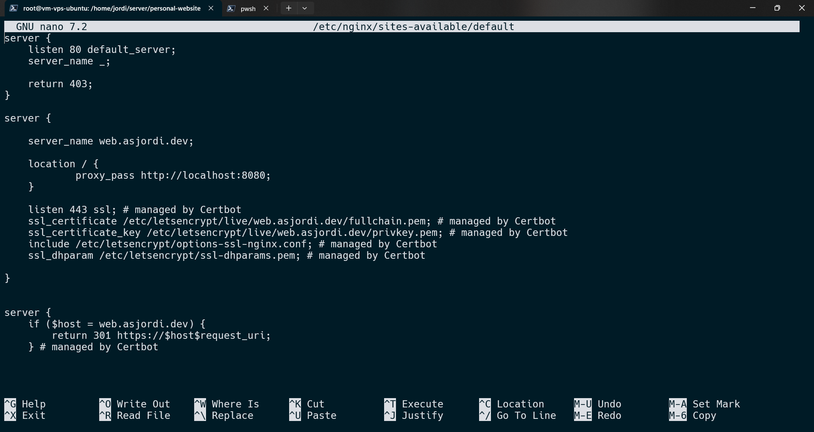
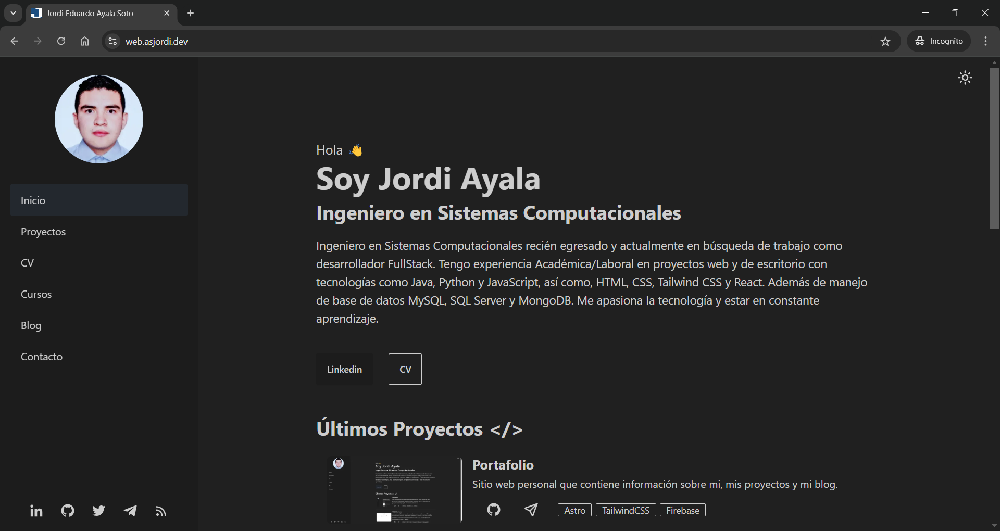

En esta guía se detalla el proceso para poder desplegar contenedores de Docker en un servidor o VPS con Ubuntu, además de configurar Nginx como proxy inverso, configurar un dominio que apunte a nuestro servidor y agregar un certificado SSL gratuito utilizando Certbot, todo con el objetivo de exponer a internet un servicio web, ya sea una aplicación web, una API o un sitio web estático desde nuestro propio servidor.

Para comenzar debemos acceder mediante SSH a nuestro servidor o VPS.

```bash
ssh -i <ruta de la llave privada> <usuario>@<ip>
```

Una vez dentro del servidor, lo primero que debemos hacer es actualizar los paquetes.

```bash
sudo apt-get update
sudo apt-get upgrade -y
```

## Instalar Docker

La instalación de Docker utilizando el repositorio `apt` se divide en dos pasos, en el primero se configura el repositorio y en el segundo se instala Docker. Comenzamos con el primero, solo es necesario ejecutar por separado cada uno de los siguientes comandos.

```bash
sudo apt-get update
```

```bash
sudo apt-get install ca-certificates curl
```

```bash
sudo install -m 0755 -d /etc/apt/keyrings
```

```bash
sudo curl -fsSL https://download.docker.com/linux/ubuntu/gpg -o /etc/apt/keyrings/docker.asc
```

```bash
sudo chmod a+r /etc/apt/keyrings/docker.asc
```

```bash
# Add the repository to Apt sources:
echo \
  "deb [arch=$(dpkg --print-architecture) signed-by=/etc/apt/keyrings/docker.asc] https://download.docker.com/linux/ubuntu \
  $(. /etc/os-release && echo "$VERSION_CODENAME") stable" | \
  sudo tee /etc/apt/sources.list.d/docker.list > /dev/null
```

```bash
sudo apt-get update
```

Ahora instalamos la última versión de Docker engine.

```bash
sudo apt-get install docker-ce docker-ce-cli containerd.io docker-buildx-plugin docker-compose-plugin
```

Para verificar que Docker se ha instalado correctamente ejecutamos el siguiente comando, que lo que hace es descargar y ejecutar en un contenedor la imagen `hello-world`.

```bash
sudo docker run hello-world
```

Si deseas comprobar la versión de Docker que se ha instalado, puedes ejecutar el siguiente comando.

```bash
sudo docker --version
```

Podemos revisar el estado del servicio de Docker con el siguiente comando:

```bash
sudo systemctl status docker
```

Por último verificamos que se haya instalado `docker compose` ejecutando el comando `docker compose`. Si tienes algún problema con la instalación siempre puedes consultar la [documentación oficial](https://docs.docker.com/engine/install/ubuntu/#install-using-the-repository).

## Copiar archivos al servidor

En este paso se deben copiar los archivos necesarios para construir la imagen de Docker de un proyecto, esto es opcional, ya que se puede tener un registro privado de Docker y descargar la imagen directamente, o incluso tener un archivo `docker-compose.yml` para levantar los contenedores necesarios, todo depende de nuestras necesidades. Para este caso clonaré un repositorio propio desde GitHub mediante HTTPS (se puede utilizar SSH, pero hay que configurar las llaves para la conexión) en la ruta `/home/jordi/server`, esta carpeta será donde se ubicarán los proyectos a desplegar.

```bash
sudo mkdir /home/jordi/server
```

```bash
git clone https://github.com/ASJordi/personal-website.git
```

Entramos a la carpeta del proyecto y debemos verificar que se encuentre el archivo `Dockerfile`, o si se tiene un archivo `docker-compose.yml`, ambas son opciones válidas.



## Construir la imagen de Docker

Ahora que tenemos los archivos necesarios para construir la imagen, nos ubicamos en la carpeta del proyecto y construimos la imagen de Docker, es importante asignar una versión para futuras actualizaciones.

```bash
sudo docker build --tag asjordi/website:1.0.0 .
```

Esperamos a que termine el proceso de construcción, en este caso la imagen contiene un sitio web estático, básicamente el código fuente de mi sitio web personal. Una vez que el proceso termina, ejecutamos el siguiente comando para verificar que la imagen se encuentre disponible de manera local.

```bash
sudo docker image ls
```

## Crear un contenedor con la imagen

Si ya tenemos la imagen disponible localmente, o en un registro privado de Docker, procedemos a crear un contenedor, el comando puede variar de acuerdo a la configuración que se necesite, en este caso se va a mapear el puerto 80 del contenedor al puerto 8080 del servidor, y se le asigna el nombre `website` al contenedor.

```bash
sudo docker container run -dp 8080:80 --name website asjordi/website:1.0.0
```

Verificamos que el contenedor se encuentre corriendo.

```bash
sudo docker container ls
```

En caso de que tengamos un archivo `docker-compose.yml` con la configuración necesaria para levantar los contenedores, podemos ejecutar el siguiente comando.

```bash
sudo docker-compose up -d
```

Podemos verificar que los contenedores se encuentren corriendo con el siguiente comando.

```bash
sudo docker compose ps
```

En caso de que alguno de los contenedores tenga un sitio web, podemos hacer un `curl` a `localhost` más el puerto que se ha mapeado con el contenedor.

```bash
curl localhost:8080
```

Si todo ha salido bien, deberíamos ver el sitio web en la terminal. Hasta este punto ya tenemos Docker configurado con los contenedores necesarios corriendo, ahora vamos a configurar Nginx para exponer el puerto 80 del servidor.

## Instalar nginx

Podemos instalar `nginx` de dos maneras, utilizando un contenedor de Docker o instalándolo directamente en el servidor, en este caso utilizaré la segunda opción. Para instalar `nginx` solo se deben ejecutar los siguientes dos comandos.

```bash
sudo apt update
sudo apt install nginx
```

Verificamos el estado del servicio de `nginx`.

```bash
systemctl status nginx
```

Si ingresamos a la IP del servidor desde un navegador, deberíamos ver la página de bienvenida de `nginx`.



## Configurar dominio

Ahora que nuestro servidor está corriendo y es accesible desde internet, necesitamos configurar un nombre de dominio. Para ello es necesario que tengamos un dominio, y que podamos acceder a la configuración de DNS del proveedor de dominio. Una vez que tengamos acceso a la configuración de DNS, debemos agregar un registro A con la IP del servidor, esperar a que se propague el DNS y luego ingresar al dominio desde el navegador, deberíamos ver la página de bienvenida de `nginx`.

En mi caso tengo un dominio personal, `asjordi.dev`, y voy a utilizar un subdominio, `web.asjordi.dev`, para apuntar a mi servidor. La configuración de DNS puede variar de acuerdo al proveedor de dominio, en mi caso utilizo Cloudflare.



## Configurar nginx

Para poder exponer el sitio web que se encuentra corriendo en el contenedor, necesitamos configurar `nginx` como proxy inverso, para ello debemos editar el archivo de configuración de `nginx` que se encuentra en `/etc/nginx/sites-available/default`.

```bash
sudo nano /etc/nginx/sites-available/default
```

Borramos todo el contenido del archivo, podemos seleccionar todo con `Shift + flecha abajo` y después presionar `Ctrl + K` o `Ctrl + Shift + K`, probar con uno de los dos. Y colocamos la siguiente configuración.

```nginx
server {
    listen 80 default_server;
    server_name _;

    return 403;
}

server {

    listen 80;

    server_name web.asjordi.dev;

    location / {
            proxy_pass http://localhost:8080;
    }
}
```

Comencemos a explicar la configuración:

- Primer bloque `server`:
  - `listen 80 default_server`: Este servidor escucha en el puerto 80 y es el servidor por defecto.
  - `server_name _;`: El guion bajo (**_**) significa que este bloque manejará todas las peticiones que no coincidan con ningún otro _server_name_.
  - `return 403`: Devuelve un error 403 (Forbidden) para cualquier petición que llegue a este servidor por defecto, por ejemplo, si alguien intenta acceder al servidor mediante la IP.
- Segundo bloque `server`:
  - `listen 80`: Este servidor escucha en el puerto 80.
  - `server_name web.asjordi.dev;`: Indica que solo procesará peticiones que vengan con este nombre de dominio (aquí se debe colocar el dominio propio que se configuró en el DNS).
  - `location /`: Indica que para todas las rutas.
  - `proxy_pass http://localhost:8080;`: Redirigirá las peticiones a un servidor local que está corriendo en el puerto 8080, que es donde se encuentra corriendo el contenedor (aquí se debe colocar el puerto que se mapeó con el contenedor).

Una vez que hemos configurado los aspectos necesarios, presionar `Ctrl + O` seguido de `Enter` para guardar los cambios y `Ctrl + X` para salir de nano. Procedemos a verificar la configuración con el siguiente comando.

```bash
nginx -t
```

Si no hay errores, reiniciamos el servicio de `nginx`.

```bash
systemctl restart nginx
```

Ahora podemos ingresar a nuestro dominio y deberíamos ver el sitio web que se encuentra corriendo en el contenedor. En caso de que ingresemos utilizando la IP del servidor, deberíamos ver un error 403.



## Instalar Certbot

Ya hemos configurado nuestro servidor con Docker, Nginx y un dominio, pero aún no tenemos un sitio web seguro. Solo nos hace falta agregar un certificado SSL de manera gratuita, para ello vamos a generar un certificado SSL de Let's Encrypt utilizando Certbot. Para lo cual ejecutamos uno a uno los siguientes comandos.

- Instalar dependencias necesarias.

```bash
sudo apt install python3 python3-venv libaugeas0
```

- Configurar un entorno virtual para Certbot.

```bash
sudo python3 -m venv /opt/certbot/
```

```bash
sudo /opt/certbot/bin/pip install --upgrade pip
```

- Instalar Certbot

```bash
sudo /opt/certbot/bin/pip install certbot certbot-nginx
```

- Crear un enlace simbólico para poder ejecutar Certbot desde cualquier lugar.

```bash
sudo ln -s /opt/certbot/bin/certbot /usr/bin/certbot
```

## Configurar Certbot

Para comenzar con la generación del certificado SSL, ejecutamos el siguiente comando.

```bash
sudo certbot
```

A continuación realizamos las siguientes acciones:

- Ingresamos nuestro email.
- Aceptamos los términos y condiciones.
- Aceptamos o no compartir nuestro email.

Certbot comenzará a buscar los dominios que estén configurados en nginx, una vez que los encuentre, nos mostrará una lista de los dominios y nos preguntará si queremos configurar un certificado SSL para alguno de ellos. Seleccionamos el dominio que queremos configurar ingresando el número que aparece al lado del dominio.



Una vez que termina el proceso, Certbot nos mostrará un mensaje indicando que la configuración se ha realizado con éxito, es decir, se ha configurado el certificado SSL para el dominio que seleccionamos. Ahora solo necesitamos configurar la autorrenovación del certificado, ejecutamos el siguiente comando, que agrega un cron job a `/etc/crontab` que se ejecutará dos veces al día y renovará el certificado si es necesario.

```bash
echo "0 0,12 * * * root /opt/certbot/bin/python -c 'import random; import time; time.sleep(random.random() * 3600)' && sudo certbot renew -q" | sudo tee -a /etc/crontab > /dev/null
```

Si entramos al archivo de configuración de nginx en `/etc/nginx/sites-available/default` podemos ver que Certbot ha agregado la configuración necesaria para el certificado SSL.



Si tienes alguna duda, puedes consultar la [documentación oficial de Certbot](https://certbot.eff.org/instructions?ws=nginx&os=pip). Ahora podemos ingresar a nuestro dominio y ver que el sitio web está marcado como seguro y funciona correctamente.



## Configurar ufw

Para finalizar, podemos configurar `ufw` para permitir el tráfico en los puertos necesarios, en este caso solo necesitamos permitir el tráfico en los puertos 80 y 443, que son los puertos por defecto para HTTP y HTTPS, y el puerto 22 para SSH.

```bash
sudo ufw allow ssh
```

```bash
sudo ufw allow 80
```

```bash
sudo ufw allow 443
```

Ahora habilitamos `ufw`.

```bash
sudo ufw enable
```

Podemos verificar el estado de `ufw` con el siguiente comando.

```bash
sudo ufw status
```

## Conclusión

Ya tenemos configurado un servidor con Docker, Nginx y Certbot, hemos desplegado un contenedor con un sitio web, configurado un dominio, agregado un certificado SSL y configurado la autorrenovación del certificado, todo con el objetivo de poder desplegar un servicio web en nuestro propio servidor y exponerlo a internet de manera segura. Este es solo un ejemplo de cómo se puede configurar un servidor, podemos desplegar más contenedores con diferentes servicios, agregar más dominios o subdominios, configurar más certificados SSL, entre otras cosas, todo depende de nuestras necesidades.