## ¿Qué es Railway?

Railway.app es un proveedor de servicios en la nube que permite desplegar diversos tipos de aplicaciones web fácilmente.

Es tan sencillo su uso como, configurar el despliegue a partir de GitHub y realizar algunas configuraciones básicas por medio de su interfaz. Además de que, en su plan gratuito brinda 500 horas de ejecución y 5 dólares por mes.

En este tutorial se muestra el proceso de despliegue de un proyecto de Node.js, específicamente un API en Railway.

## Requisitos

- Tener una cuenta en [Railway](https://railway.app/).
- Proyecto Node.js

## Crear proyecto en Railway

* Para crear un proyecto en Railway, se debe ingresar a la plataforma y seleccionar la opción **New Project**.

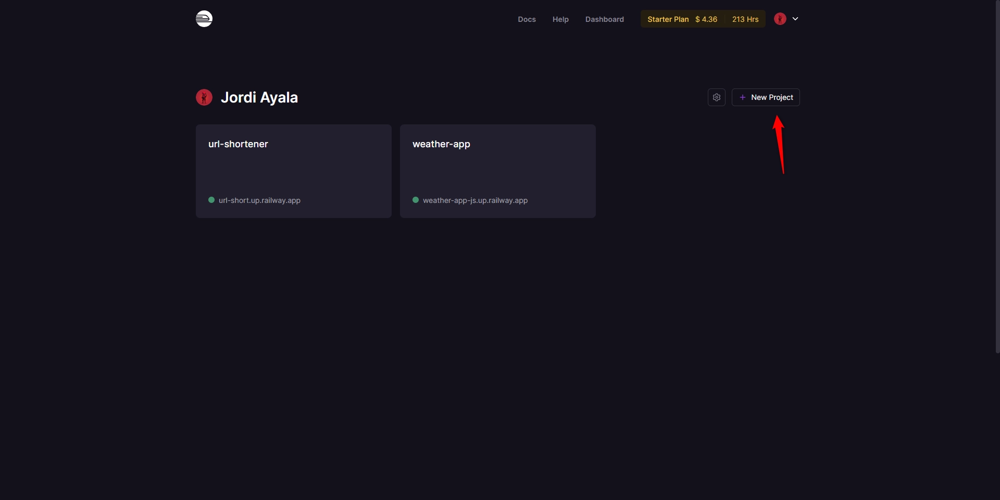

* En la siguiente pantalla seleccionar **Deploy from GitHub repo**, esto permitirá desplegar el proyecto desde GitHub y configurar el despliegue de forma automática.

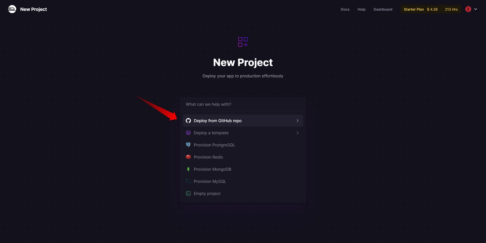

* A continuación, se mostrarán los proyectos alojados en GitHub y a los cuales Railway tiene acceso, solo basta con seleccionar el proyecto deseado.

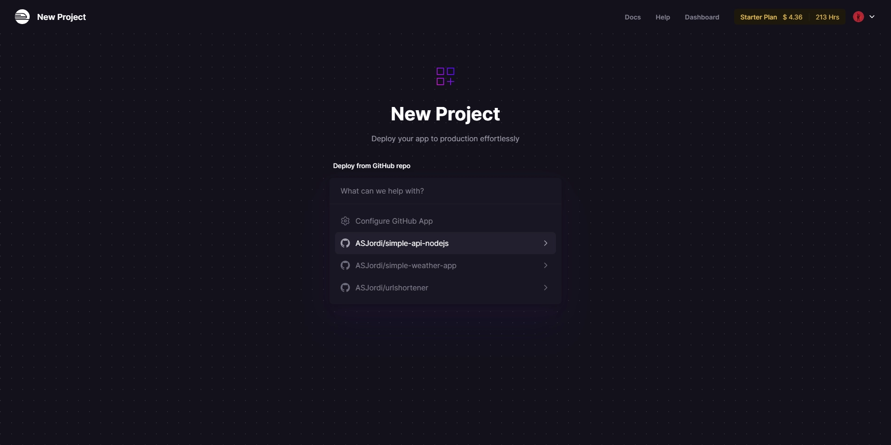

* En caso de no ver el proyecto, hacer clic en **Configure GitHub App** y dar los permisos necesarios para que Railway acceda al repositorio deseado.

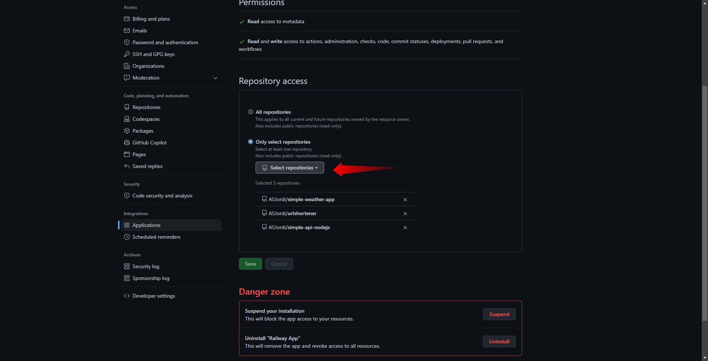

* En la siguiente ventana tenemos dos opciones, **Deploy Now** y **Add variables**, realmente no hay diferencia en la opción a elegir, en caso de que tu proyecto tenga variables de entorno, seleccionar la opción 2 o simplemente hacer clic en **Deploy Now** y más adelante se pueden configurar.

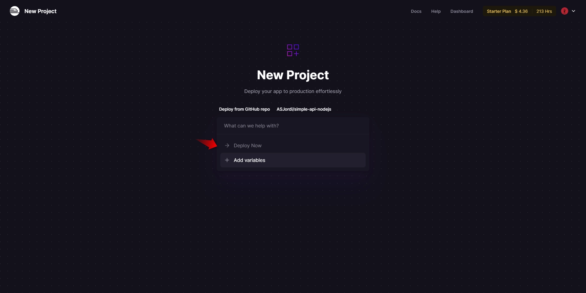

* Railway comenzará la creación y despliegue automático de la aplicación de Node.js, es normal que la primera ejecución falle en caso de requerir variables de entorno no configuradas o conexiones a otros servicios, por ejemplo, MySQL.

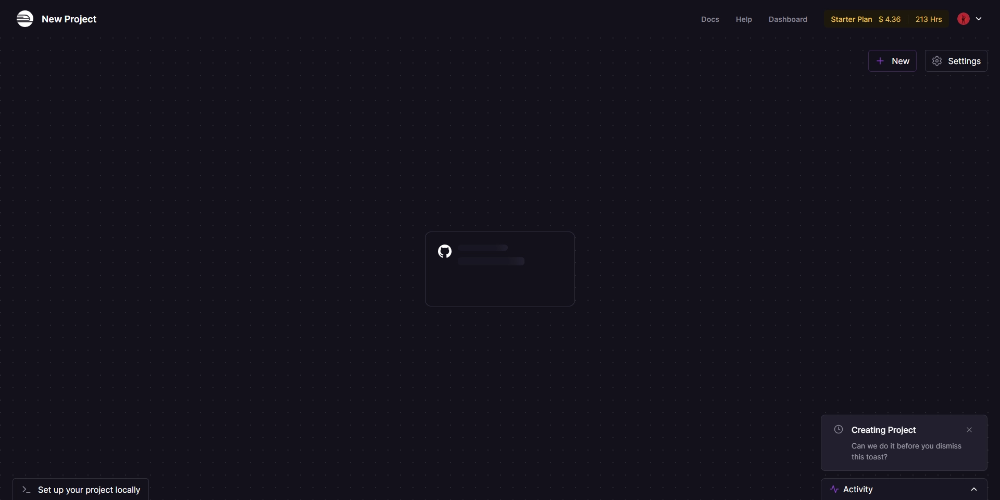

## Configurar variables de entorno

* Para configurar las **variables de entorno** del proyecto hacer clic sobre el servicio, se mostrará una ventana con diversas configuraciones, seleccionar **Variables**, clic en **New Variable** e ingresar el nombre y valor correspondiente, para guardar hacer clic en **Add**.

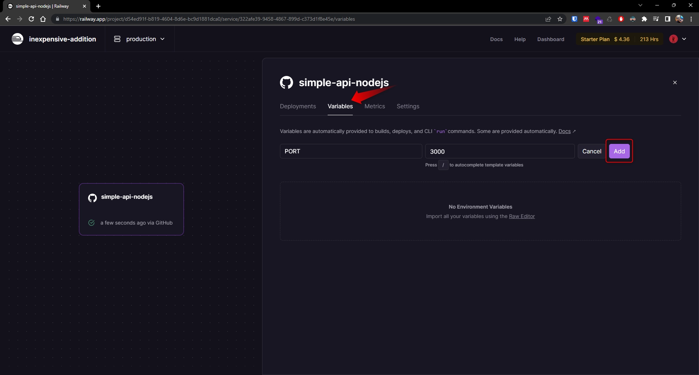

* Una vez agregadas las variables de entorno necesarias, se configurará automáticamente un nuevo deploy. En la sección **Deployments** se puede ver el estado.

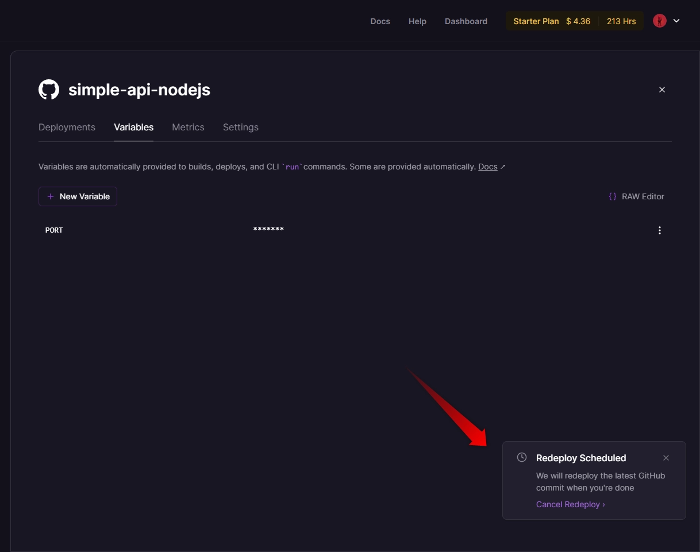

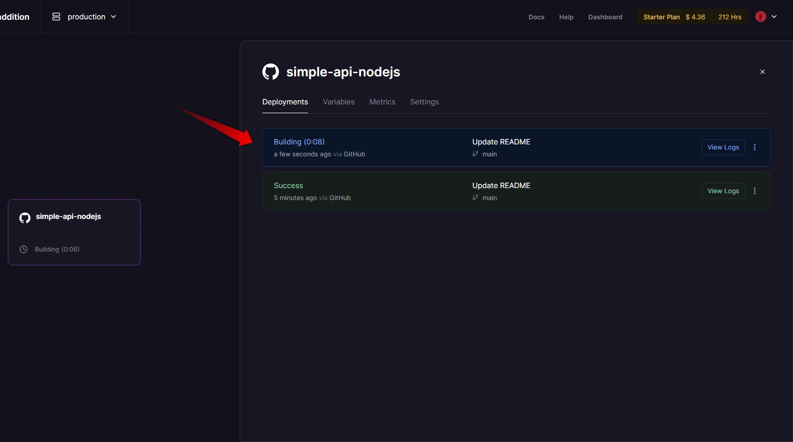

## Configurar dominio

* En este punto la aplicación de Node.js ya se encuentra desplegada, pero aún no tiene asignado un dominio para su consulta, para ello dirigirse a la sección **Settings** y seleccionar **Generate Domain** para generar un dominio.

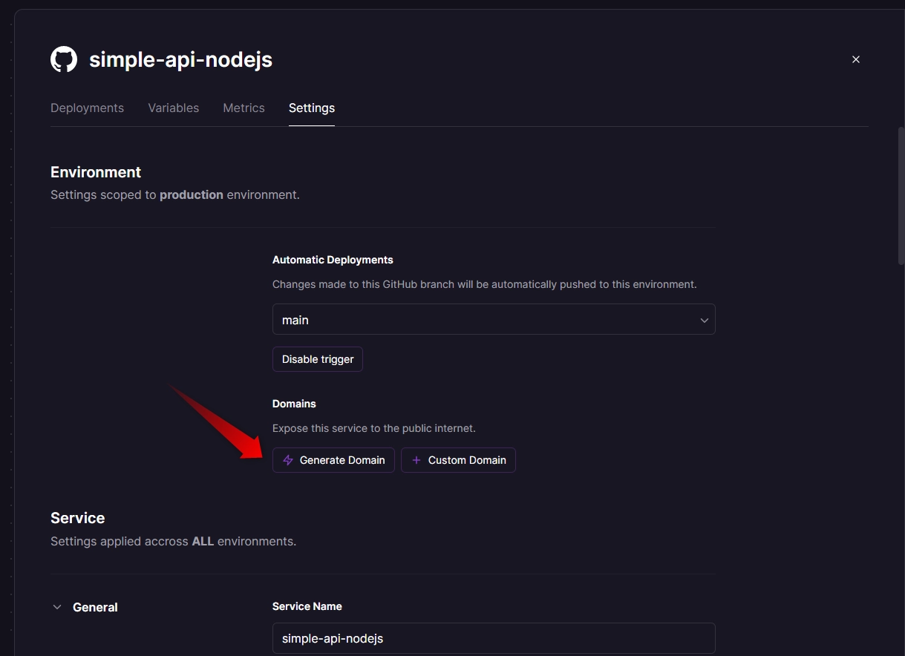

* Este dominio puede configurarse posicionando el cursor sobre el apartado del dominio actual y clic en el botón **Editar**.

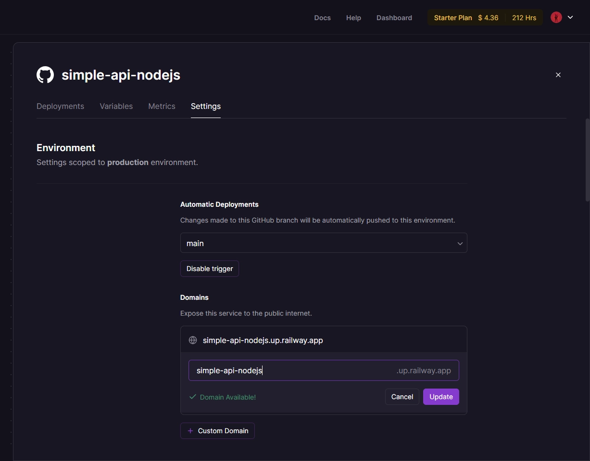

* Una vez realizado este proceso, podemos acceder a nuestra aplicación a través del dominio proporcionado, o incluso configurar uno propio.

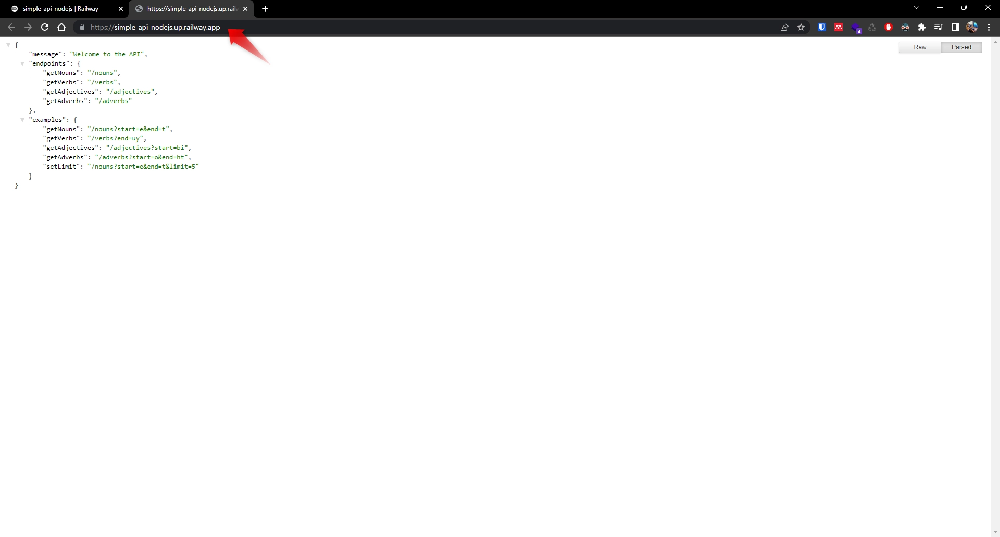

Estos son todos los pasos necesarios para el despliegue de una aplicación de Node.js en Railway, en caso de no contar con un repositorio de GitHub, también se puede configurar utilizando el [CLI]( https://docs.railway.app//develop/cli) de Railway.
