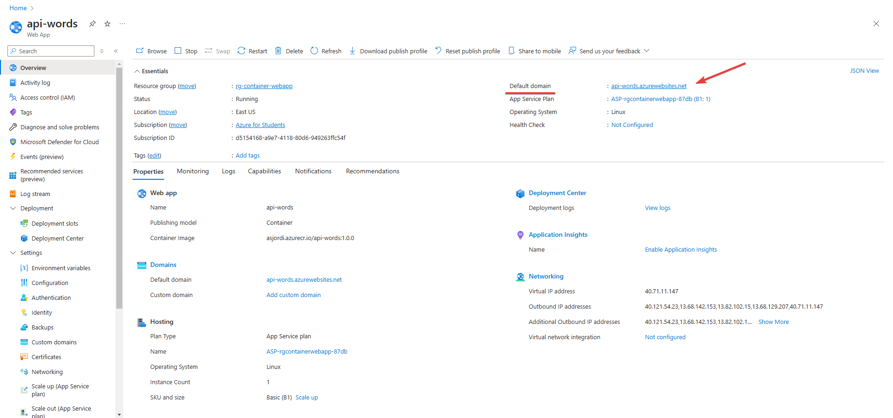

Generalmente, podríamos pensar que para desplegar un contenedor de Docker con una aplicación web o API necesitamos una máquina virtual o algún servicio más completo. Sin embargo, en Azure lo podemos realizar utilizando un **App Service**, que es un servicio que permite ejecutar contenedores de Linux personalizados, también conocidos como _Webapp for containers_. De esta manera podemos desplegar contenedores de varios registros, como Docker Hub o Azure Container Registry. En este post, veremos cómo desplegar un contenedor de Docker desde Azure Container Registry en una WebApp.

## Configurar el registro de contenedores

Para comenzar, necesitamos tener un registro de contenedores en Azure con la imagen que queremos desplegar. En caso de que aún no tengas un registro de contenedores, puedes crear uno siguiendo este [tutorial](https://asjordi.dev/blog/como-subir-imagenes-de-docker-a-azure-container-registry) donde se explica a detalle el proceso de creación y subida de imágenes.

En este caso utilizaré una imagen propia de una API básica de Node.js, puedes consultar el código fuente en este [repositorio](https://github.com/ASJordi/simple-api-nodejs). Una vez que tengamos el registro de contenedores y la imagen a utilizar, podemos continuar con la creación de la WebApp.


## Habilitar cuenta de administrador en el registro de contenedores

Para algunos servicios de Azure es necesario que la cuenta de administrador del registro de contenedores se encuentre habilitada, por defecto esta opción se encuentra deshabilitada. En este caso, dado que vamos a desplegar un contenedor desde un registro en una _Azure Web App for Containers_ es necesario habilitar esta opción. Para ello, debemos iniciar sesión desde la CLI de Azure con el siguiente comando:

```bash
az login
```

Ahora debemos iniciar sesión en el registro de contenedores:

```bash
az acr login --name <nombre_registro>

# Ejemplo
az acr login --name asjordi
```

Una vez que hayamos iniciado sesión en el registro de contenedores, ejecutamos el siguiente comando para habilitar la cuenta de administrador:

```bash
az acr update -n <acrName> --admin-enabled true

# Ejemplo
az acr update --n asjordi --admin-enabled true
```

Con esto, hemos habilitado la cuenta de administrador en el registro de contenedores y podemos continuar con el proceso de despliegue de la WebApp. Si tienes alguna duda con este proceso, puedes consultar la [documentación oficial](https://learn.microsoft.com/es-mx/azure/container-registry/container-registry-authentication?tabs=azure-cli#admin-account).

## Crear una WebApp

Iniciar sesión en el portal de Azure y buscar el servicio **App Services**. Una vez dentro, clic en el botón **Crear** y seleccionar **Web app**.


Realizamos los siguientes pasos:

- Seleccionar la suscripción y el grupo de recursos (o creamos uno nuevo). 
- Posteriormente en **Detalles de Instancia** ingresamos un nombre único para la WebApp (podemos marcar o no la opción de _prueba un nombre de host único por defecto (preview)_).
- Seleccionar **Contenedor** y **Linux** como sistema operativo.
- Elegir la región en la que se desplegará la WebApp.
- En el apartado de **Plan de servicio**, seleccionar un plan de servicio existente o crear uno nuevo, en este caso seleccioné el plan de servicio gratuito.


Hacemos clic en el apartado de **Contenedor**:

- En **Fuente de la imagen**, seleccionamos **Azure Container Registry**.
- En **Opciones**, seleccionamos **Contenedor único**.

En **Opciones de Azure Container Registry** seleccionamos el registro de contenedores previamente creado, la imagen y la etiqueta que queremos desplegar.

Antes de continuar, en caso de que se muestre una advertencia indicando que no tenemos permisos para acceder al registro como se muestra en la siguiente imagen puede que no tengamos habilitada la cuenta de administrador en el registro de contenedores, en ese caso, realizar el paso [Habilitar cuenta de administrador en el registro de contenedores](#habilitar-cuenta-de-administrador-en-el-registro-de-contenedores)


Una vez que tenemos seleccionado el registro de contenedores, la imagen y la etiqueta, y estamos seguros de que no se necesita un comando personalizado para la ejecución del contenedor (si es necesario se puede agregar en el apartado de **Comando de inicio**), podemos hacer clic en **Revisar y crear** para verificar que la configuración sea correcta y finalmente hacer clic en **Crear** para desplegar la WebApp.


Al finalizar la implementación, seleccionar **Ir al recurso** para acceder al recurso de la WebApp.

## Acceder a la WebApp

Una vez dentro del recurso, en la sección de **Overview** podemos ver en la parte superior derecha la URL de la WebApp o el dominio por defecto, en este caso, la URL es `api-words.azurewebsites.net`.



Al acceder a la URL, deberíamos ver el contenido de nuestra imagen, por ejemplo, una aplicación web o una API.


## Conclusiones

Desplegar un contenedor de Docker en una WebApp en Azure es una tarea sencilla y rápida de realizar, además de que tenemos opciones un poco más avanzadas disponibles dentro del servicio de App Services para trabajar con contenedores. En este caso, vimos cómo desplegar un contenedor de Docker desde Azure Container Registry en una WebApp, pero también podemos desplegar contenedores de Docker Hub o de otros registros siguiendo el mismo proceso. Si solo realizas esto a manera de prueba, recuerda eliminar el grupo de recursos para evitar cargos adicionales. Cualquier duda puedes consultar la [documentación oficial](https://learn.microsoft.com/es-mx/azure/app-service/).