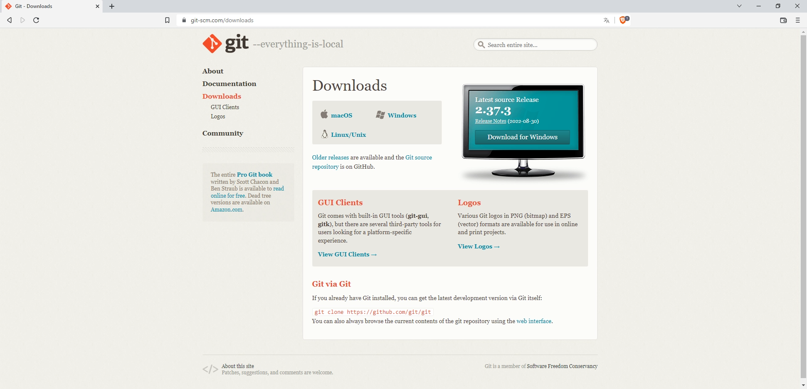
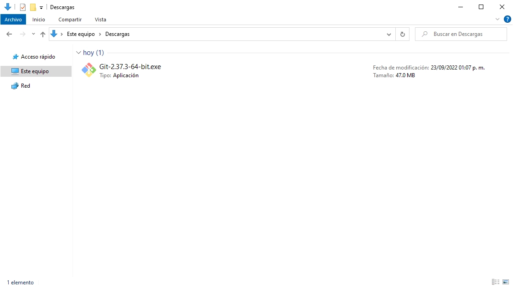
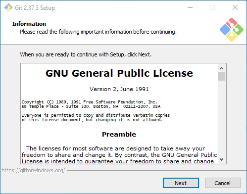
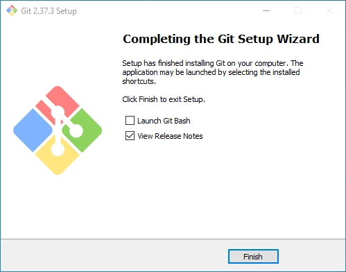
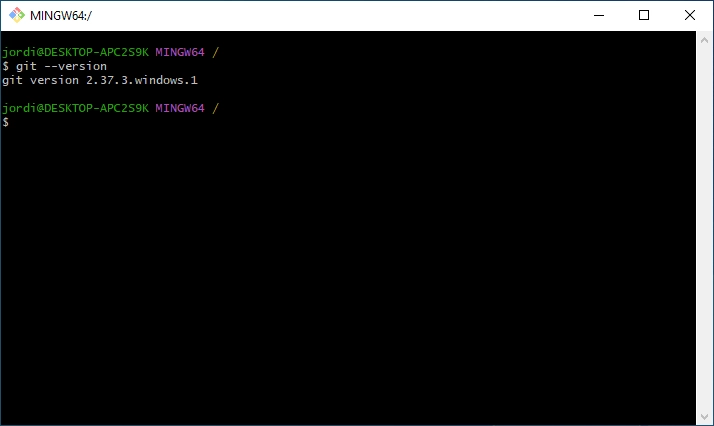

Git es un sistema de control de versiones distribuido. Actualmente es el más popular dentro del mundo de desarrollo de software. Fue creado por Linux Torvalds y el equipo de desarrollo del Kernel de Linux como una alternativa de código abierto.

Un sistema de control de versiones permite la administración de un proyecto de desarrollo de software en general, sin importar el tamaño o número de personas que lo integren. De esta manera, permite controlar los distintos cambios realizados a cualquier archivo de un proyecto, teniendo la posibilidad de comparar estados de archivos a lo largo del tiempo, trabajar de manera colaborativa, entre muchas más características.

Git es multiplataforma, por lo que se puede usar en Windows, Linux o Mac. Así mismo, existen alternativas que proveen de una interfaz gráfica o GUI para trabajar con él, dado que por defecto se utiliza empleando Git Bash, es decir, la interfaz de Git por línea de comandos o, la propia línea de comandos del sistema operativo.

En este tutorial se muestra como **instalar y configurar Git en Windows**, de una manera fácil y rápida.

## ¿Qué es la terminal?

La línea de comandos o Command Line Interface (CLI) en inglés, es una herramienta que permite dar instrucciones al ordenador a través de comandos en formato texto.

Comúnmente, cuando se utiliza un sistema operativo, se realiza a través de una interfaz grafica que es mas amigable con el usuario, aunque existen muchas razones para utilizar la línea de comandos, por ejemplo, para utilizar **Git** en un proyecto de desarrollo de software. En Windows existe el *Símbolo de Sistema (Command Prompt)*, o *PowerShell*.

# Descargar Git

Antes de comenzar con el proceso de instalación, es necesario asegurarse de que no está instalado Git en la computadora. Para ello es necesario ejecutar el siguiente comando en la línea de comandos de Windows.

```bash
git --version
```

En caso de estar instalado, aparecerá un mensaje con la versión de Git actual en el sistema y ya puede pasar a la sección de *configuración de Git*, en caso contrario es necesario seguir con los pasos siguientes.

```bash
git version 2.37.3.windows.1
```

Para realizar la descarga es necesario dirigirse al sitio oficial de Git en la sección de *Descargas* o simplemente hacer [clic aquí](https://git-scm.com/downloads).

A continuación, seleccionar **Download for Windows**, posteriormente hacer clic en **click here to download** y en automático comenzará la descarga del asistente de instalación de Git.



# Instalar Git

Para instalar Git, basta con *ejecutar como administrador* el archivo de instalación que se descargo en el paso anterior.



A continuación, se abrirá el asistente de instalación, para lo cual solo es necesario hacer clic en **Next** en cada uno de los pasos siguientes para continuar con la instalación.



Una vez finalizada la instalación, se mostrara la siguiente ventana, solo es necesario hacer clic en **Finish**.



Para verificar la instalación y versión de Git instalada, abrir la línea de comandos del sistema, solo es necesario dirigirse a Inicio y escribir *cmd*. O en caso de querer utilizar la propia línea de comandos de Git, escribir *git bash*. Nuevamente ejecutar el comando *git --version*.



# Configurar Git

A continuación, se muestran los comandos básicos de configuración para Git. Es necesario ejecutar uno por uno dentro de la línea de comandos.

```bash
git config --global user.name "Nombre de usuario"
```

```bash
git config --global user.email "Email de usuario"
```

```bash
git config --global init.defaultBranch main
```

```bash
git config --global user.ui true
```

```bash
# Estandizar saltos de línea en Windows
git config --global core.autocrlf true
```

```bash
# Asignar VS Code como editor de texto por defecto
git config --global core.editor "code --wait"
git config --global -e
```

```bash
# Listar todas las opciones de configuración
git config -h
```

Es necesario sustituir los datos entre comillas por el nombre y correo electrónico a utilizar, ya que estos se verán reflejados al momento de utilizar Git en un proyecto.

Por último, para poder ver la lista de configuraciones actuales, ejecutar el siguiente comando.

```bash
git config --list
```

Una vez terminados todos los pasos anteriores, Git se encuentra instalado y configurado dentro del sistema. En caso de tener alguna duda, recordar que siempre está disponible la documentación de Git en el sitio [`https://git-scm.com/doc`](https://git-scm.com/doc).

**Sugerencias para trabajar con Git**
1. Utilizar **[Windows Terminal](https://apps.microsoft.com/store/detail/windows-terminal/9N0DX20HK701?hl=es-mx&gl=mx)** como línea de comandos. Considerando que es una nueva terminal de Windows que permite abrir múltiples sesiones de línea de comandos, como PowerShell, CMD, WSL y más, en una sola ventana.
2. Utilizar como editor de código **[Visual Studio Code](https://code.visualstudio.com)**. Considerando que tiene una línea de comandos integrada y múltiples extensiones que permiten trabajar con Git de manera gráfica. Puedes ver como instalar Visual Studio Code en Windows [en este tutorial](https://personal-website-asjordi.web.app/blog/post1/).
