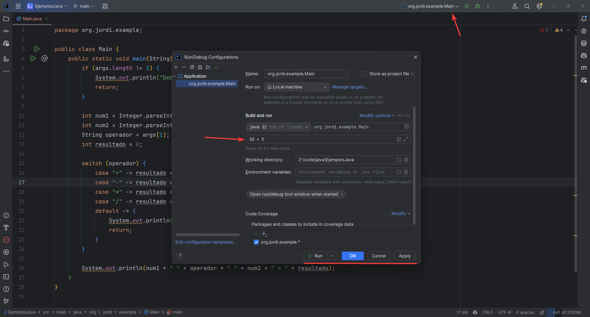

El método `main` nos permite especificar el código que queremos que se ejecute cuando lanzamos nuestra aplicación, de esta manera la clase donde se encuentra será la clase principal o punto de entrada de nuestra aplicación. Por ejemplo, consideremos la siguiente clase `Main` que contiene el método `main`:

```java
public class Main {
    public static void main(String[] args) {
        System.out.println("Hola Mundo!");
    }
}
```

En versiones recientes de Java podemos ejecutar esta clase desde la terminal con el comando `java Main.java` y veremos que se imprime en la consola el mensaje `Hola Mundo!` (o desde el propio IDE). El comando que ejecutamos se compone de dos partes, la primera es `java` que es el comando que se encarga de ejecutar el código Java y la segunda es `Main.java` que es el nombre de la clase que contiene el método `main`, en este punto estamos utilizando el concepto de pasar argumentos a algo, en este caso el nombre de la clase que queremos ejecutar.

> Nota: Comúnmente se utiliza el signo `-` seguido de una letra o palabra para indicar que se trata de un argumento, por ejemplo `-version` para obtener la versión de Java que tenemos instalada en nuestro sistema. Cada programa puede tener sus propios argumentos y significados.

```bash
java -version
```

Entendiendo esto, el propósito de `String[] args` es permitirnos pasar argumentos a nuestra aplicación al momento que la ejecutamos, por lo que cualquier argumento que coloquemos después del nombre de la clase será almacenado en el arreglo `args` y podremos acceder a ellos desde el método `main`. De esta forma, si ejecutamos `java Main.java` todo lo que pongamos después de `Main.java` (nombre de la clase) y separado por un espacio será considerado un argumento y almacenado en el arreglo `args`.

Comencemos ejecutando nuestra aplicación sin pasar ningún argumento e imprimiendo el arreglo `args` por consola con la ayuda del método `Arrays.toString`:

```java
import java.util.Arrays;

public class Main {
    public static void main(String[] args) {
        System.out.println(Arrays.toString(args));
    }
}
```

```bash
java Main.java

# Salida
[]
```

Obtenemos un arreglo vacío, ya que no estamos pasando ningún argumento, pero si ejecutamos el siguiente comando obtenemos un resultado diferente:

```bash
java Main.java hola mundo

# Salida
[hola, mundo]
```

Estamos pasando dos argumentos `hola` y `mundo` y estos son manejados como **args** en el método `main`, por lo que podemos acceder y realizar operaciones con ellos, podemos pasar tantos argumentos como sean necesarios. Al final el propósito de `String[] args` es almacenar todos los argumentos que pasamos al ejecutar nuestra aplicación y permitirnos acceder a ellos desde el método `main`. La parte más complicada es procesar todos los argumentos que se reciben, por ejemplo, para realizar una aplicación de línea de comandos tenemos que procesar, validar y convertir los argumentos para que sean útiles en nuestra aplicación.

## Ejemplo

Queremos hacer una pequeña aplicación que reciba por consola 3 parámetros en el siguiente orden:

1. Número 1
2. Operador aritmético
3. Número 2

A partir de estos parámetros realizaremos la operación correspondiente y mostraremos el resultado en consola. Para ello, primero validamos que se pasen los 3 argumentos, convertimos los argumentos a los tipos de datos correspondientes, en este caso el primer y tercer argumento al tipo `int` (números), y como los argumentos son cadenas de texto no es necesario convertir el operador aritmético. Posteriormente, realizamos la operación correspondiente y mostramos el resultado en consola.

```java
public class Main {
    public static void main(String[] args) {
        if (args.length != 3) {
            System.out.println("Debes pasar 3 argumentos: Número 1, Operador aritmético y Número 2");
            return;
        }

        int num1 = Integer.parseInt(args[0]);
        int num2 = Integer.parseInt(args[2]);
        String operador = args[1];
        int resultado = 0;

        switch (operador) {
            case "+" -> resultado = num1 + num2;
            case "-" -> resultado = num1 - num2;
            case "*" -> resultado = num1 * num2;
            case "/" -> resultado = num1 / num2;
            default -> {
                System.out.println("Operador aritmético no válido");
                return;
            }
        }

        System.out.println(num1 + " " + operador + " " + num2 + " = " + resultado);
    }
}
```

Ahora podemos ejecutar nuestra aplicación desde la terminal y pasar los argumentos correspondientes:

```bash
java Main.java 10 + 5

# Salida
10 + 5 = 15
```

```bash
java Main.java 10 - 5

# Salida
10 - 5 = 5
```

El poder pasar argumentos a una aplicación en Java no es algo único de la terminal, también se puede realizar desde el IDE, que es como comúnmente se trabaja, por ejemplo, si utilizamos IntelliJ IDEA podemos pasar argumentos desde la configuración de ejecución de la aplicación.




En conclusión, podemos notar que este es un mecanismo flexible para poder pasar argumentos a nuestra aplicación y permitirnos realizar acciones específicas con base en sus valores, aunque puede ser complicado de manejar, para estos casos podemos utilizar implementaciones que nos faciliten el trabajo como [Apache Commons CLI](https://commons.apache.org/proper/commons-cli/) o [JCommander](https://jcommander.org/). Si quieres ver otro ejemplo de como se puede utilizar `String[] args` en una aplicación de línea de comandos puedes revisar el siguiente [enlace](https://github.com/ASJordi/javawc).